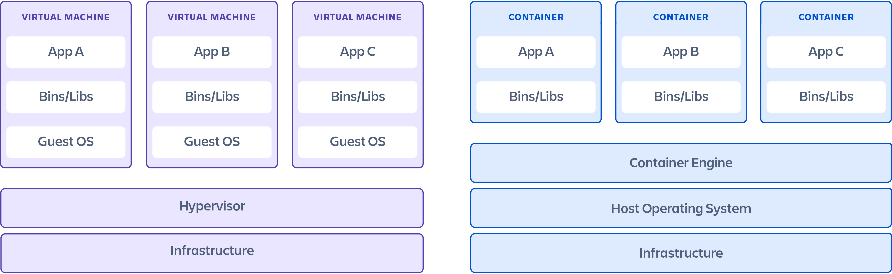

# Difference Between Virtual Machines & Containers

Containers and virtual machines are both resource virtualization technologies, allowing system resources like RAM, CPU, disk storage, and networking to be transformed into multiple virtual instances. The main difference between the two lies in their approach: virtual machines simulate an entire machine, including the hardware, while containers focus on virtualizing only the software layers above the operating system.

## General Differences

<table style={{ width: "100%", tableLayout: "fixed" }}>
  <thead>
    <tr>
      <th style={{ width: "50%" }}>Virtual Machines</th>
      <th style={{ width: "50%" }}>Docker Containers</th>
    </tr>
  </thead>
  <tbody>
    <tr>
      <td>Include a full operating system (guest OS) for each VM, running on a hypervisor.</td>
      <td>Share the host operating system's kernel.</td>
    </tr>
    <tr>
      <td>Hypervisor abstracts and virtualizes the underlying hardware for multiple VMs.</td>
      <td>Use container runtime (e.g., Docker Engine) for lightweight isolation.</td>
    </tr>
    <tr>
      <td>Each VM is completely isolated, with its own kernel, OS, and resources.</td>
      <td>Each container packages only the application and its dependencies.</td>
    </tr>
  </tbody>
</table>

## Size and Performance

<table style={{ width: "100%", tableLayout: "fixed" }}>
  <thead>
    <tr>
      <th style={{ width: "50%" }}>Virtual Machines</th>
      <th style={{ width: "50%" }}>Docker Containers</th>
    </tr>
  </thead>
  <tbody>
    <tr>
      <td>Larger in size since they include a full OS and virtualized hardware.</td>
      <td>Lightweight because they share the host OS and kernel.</td>
    </tr>
    <tr>
      <td>Slower startup times due to the OS boot process.</td>
      <td>Faster startup times (seconds or less).</td>
    </tr>
    <tr>
      <td>Require more system resources (RAM, CPU).</td>
      <td>Consume fewer resources, making them more efficient for scaling.</td>
    </tr>
  </tbody>
</table>

## Isolation

<table style={{ width: "100%", tableLayout: "fixed" }}>
  <thead>
    <tr>
      <th style={{ width: "50%" }}>Virtual Machines</th>
      <th style={{ width: "50%" }}>Docker Containers</th>
    </tr>
  </thead>
  <tbody>
    <tr>
      <td>Provide strong isolation since each VM has its own kernel and OS.</td>
      <td>Provide process-level isolation but share the host OS kernel.</td>
    </tr>
    <tr>
      <td>Better suited for running applications with strict isolation requirements.</td>
      <td>Less isolated than VMs, but sufficient for most application workloads.</td>
    </tr>
  </tbody>
</table>

## Portability

<table style={{ width: "100%", tableLayout: "fixed" }}>
  <thead>
    <tr>
      <th style={{ width: "50%" }}>Virtual Machines</th>
      <th style={{ width: "50%" }}>Docker Containers</th>
    </tr>
  </thead>
  <tbody>
    <tr>
      <td>Portability depends on the hypervisor and VM image format.</td>
      <td>Highly portable due to standardized container formats.</td>
    </tr>
    <tr>
      <td>Larger VM images can make portability slower or less convenient.</td>
      <td>Easy to build once and run anywhere (on any system with Docker installed).</td>
    </tr>
  </tbody>
</table>

## Use Cases

<table style={{ width: "100%", tableLayout: "fixed" }}>
  <thead>
    <tr>
      <th style={{ width: "50%" }}>Virtual Machines</th>
      <th style={{ width: "50%" }}>Docker Containers</th>
    </tr>
  </thead>
  <tbody>
    <tr>
      <td>Running multiple different OSes (e.g., Linux and Windows) on a single physical machine.</td>
      <td>Running microservices or cloud-native applications.</td>
    </tr>
    <tr>
      <td>Applications requiring high isolation or specific OS-level configurations.</td>
      <td>CI/CD pipelines for consistent testing and deployment.</td>
    </tr>
    <tr>
      <td>Legacy systems that depend on full OS environments.</td>
      <td>Scaling applications horizontally with lightweight instances.</td>
    </tr>
  </tbody>
</table>

## Deployment & Management

<table style={{ width: "100%", tableLayout: "fixed" }}>
  <thead>
    <tr>
      <th style={{ width: "50%" }}>Virtual Machines</th>
      <th style={{ width: "50%" }}>Docker Containers</th>
    </tr>
  </thead>
  <tbody>
    <tr>
      <td>Managed using tools like VMware, Hyper-V, or VirtualBox.</td>
      <td>Managed using tools like Docker CLI, Docker Compose, or orchestration platforms like Kubernetes.</td>
    </tr>
    <tr>
      <td>Typically slower to deploy due to OS installation/setup.</td>
      <td>Faster and simpler deployment with minimal configuration.</td>
    </tr>
  </tbody>
</table>

## Security

<table style={{ width: "100%", tableLayout: "fixed" }}>
  <thead>
    <tr>
      <th style={{ width: "50%" }}>Virtual Machines</th>
      <th style={{ width: "50%" }}>Docker Containers</th>
    </tr>
  </thead>
  <tbody>
    <tr>
      <td>Stronger security boundaries due to isolated kernels and OSes.</td>
      <td>Weaker isolation since they share the host OS kernel.</td>
    </tr>
    <tr>
      <td>Suitable for environments requiring high security.</td>
      <td>Vulnerable to kernel-level exploits if the host OS is compromised.</td>
    </tr>
  </tbody>
</table>

  
Glossary

- **Container Runtime**  
 A software that enables the running of containers. For example, Docker Engine is a popular container runtime.

- **Docker Engine**  
 A container runtime that allows developers to easily build, ship, and run containers.

- **Hypervisor**  
 A software layer that enables virtualization by abstracting the hardware resources, allowing multiple virtual machines to run on a single physical machine.

- **Kernel**  
 The core component of an operating system that manages system resources such as CPU, memory, and peripheral devices. Virtual machines and containers interact with the kernel differently.

- **Operating System (OS)**  
 Software that manages hardware and software resources on a machine. Virtual machines run a full OS, while containers share the host OS.

- **Process-Level Isolation**  
 A method where each application runs in its own isolated environment, but shares the same OS kernel. This is the approach used by containers.

- **Virtual Machine (VM)**  
 A software-based emulation of a physical computer, which runs an entire operating system (guest OS) on top of a hypervisor.

- **VM Image Format**  
 The file format used to store the complete contents of a virtual machine, including the operating system, software, and configuration files.

- **Virtualization**  
 The process of creating a virtual version of a resource, such as a server, operating system, storage device, or network resource.

- **VMware**  
 A popular company and software suite that provides virtualization solutions, including the VMware hypervisor.

- **Kubernetes**  
 An open-source platform for automating the deployment, scaling, and management of containerized applications.

- **CI/CD (Continuous Integration/Continuous Deployment)**  
 A method to frequently integrate code changes and deploy applications in an automated and consistent manner, often using containers for scalability.

- **Legacy Systems**  
 Older systems or software that are still in use, but may depend on outdated technology or architectures, often requiring full OS environments like virtual machines.

- **Microservices**  
 An architectural style where applications are built as a collection of loosely coupled, independently deployable services, which are often run in containers for scalability.

---

## References

- [Containers vs. virtual machines](https://www.atlassian.com/microservices/cloud-computing/containers-vs-vms)
- [Containers vs VMs (virtual machines): What are the differences?](https://cloud.google.com/discover/containers-vs-vms)

---