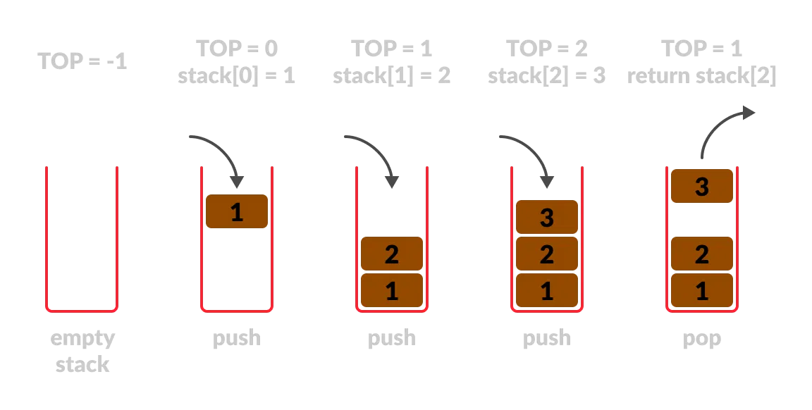

# Stacks and Recursion

In programming, a stack is a data structure that follows the Last In, First Out (LIFO) principle. This means that the last item added to the stack is the first one to be removed. You can think of it as a stack of plates: the plate you placed last is the first one you take off the top. A stack has two primary operations: 

**Push**   
Add an item to the top of the stack.  

**Pop**  
Remove the item from the top of the stack.



## Example: Factorial With Recursion

Here’s how a stack works in recursion:

```python
def factorial(n):
    if n == 1:
        return 1  # Base case
    return n * factorial(n - 1)  # Recursive case
```

If you call factorial(4), the call stack works like this:

1. Push `factorial(4)` onto the stack.
2. Push `factorial(3)` onto the stack.
3. Push `factorial(2)` onto the stack.
4. Push `factorial(1)` onto the stack.
5. `factorial(1)` returns `1` → pop from the stack.
6. `factorial(2)` computes `2 * 1` → pop from the stack.
7. `factorial(3)` computes `3 * 2` → pop from the stack.
8. `factorial(4)` computes `4 * 6` → pop from the stack.
9. The output will be `24`.

## Summary

- A **stack** is a fundamental data structure used to manage program execution and function calls.
- In recursive functions, the **call stack** tracks nested calls and ensures proper execution order (LIFO).
- Failure to manage recursion properly (e.g., forgetting a base case) can result in a **stack overflow**, crashing the program.