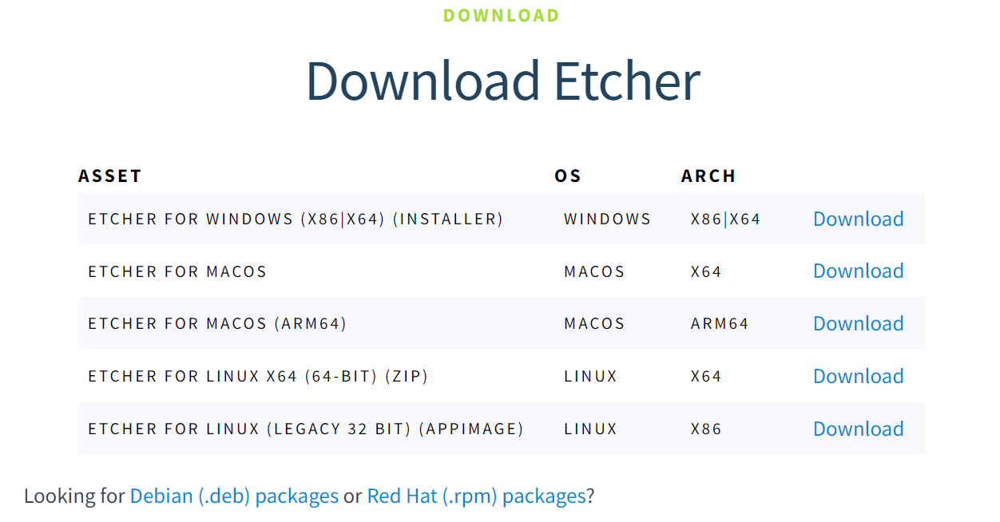

# 1-2 Establishing an SSH Connection

In this tutorial, you will learn how to establish an SSH connection between your personal PC and a remote PC running Ubuntu.

Having a GitHub account created is optional to store your authentication keys.

---

## System Requirements
- **Local machine:** A supported OpenSSH-compatible SSH client must be installed.
- **Remote host:** OpenSSH server installed on Ubuntu 16.04 or later.

---

## Step 1: Install OpenSSH

**On Your Client Machine:**

Install a supported OpenSSH-compatible SSH client by entering the following command in your terminal:

```bash
sudo apt install openssh-client
```

Install [Visual Studio Code](https://code.visualstudio.com/) and the [Remote-SSH extension](https://marketplace.visualstudio.com/items?itemName=ms-vscode-remote.remote-ssh).

**On the Server/Host:**

Install the OpenSSH server by running the following command in the terminal:

```bash
sudo apt install openssh-server
```

## Step 2: Generate SSH Keys

To generate the SSH key, run the following command:

```bash
ssh-keygen -t rsa
```

This will generate keys using the RSA algorithm. To modify the number of bits, you can use the `-b` option. For example, to generate keys with 4096 bits, use:

```bash
ssh-keygen -t rsa -b 4096
```

During the process, you will be prompted for a password. Simply press `Enter` three times when prompted to create the key. By default, the public key is saved in the file `~/.ssh/id_rsa.pub`, while the private key is stored in `~/.ssh/id_rsa`.

Next, copy the `id_rsa.pub` file to the remote host and append it to `~/.ssh/authorized_keys` by running:

```bash
ssh-copy-id username@remotehost_ip
```

- **`username`:** The name of the user on the host machine.
- **`remotehost_ip`:** The IP address of the host machine. You can find this in the Wi-Fi settings.

After this step, you will be able to establish an SSH connection to the host without being prompted for a password.

## Step 3: Import Keys from GitHub (Optional)

You may also register your SSH keys with services like GitHub. To export your keys, open the following file:

```bash
~/.ssh/id_rsa.pub
```

Using Notepad or any text editor, select all the contents and copy it.

Next, go to your GitHub settings, select **"SSH and GPG keys"**, and click **"New SSH key"**.



Paste your copied SSH key into the **"Key"** field and provide a title that is easily identifiable for you. Select **"Authentication Key"** as the key type.


On your host machine, enter the following command in your terminal:

```bash
ssh-import-id-gh username-on-github
```

The `-gh` flag tells the tool to fetch the key from GitHub.

---

## References

- [OpenSSH Server](https://documentation.ubuntu.com/server/how-to/security/openssh-server/)

---