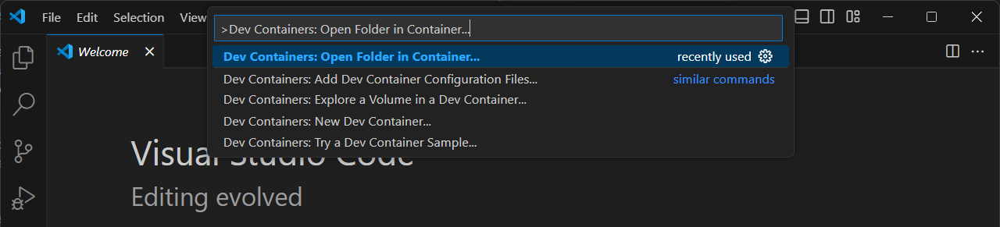
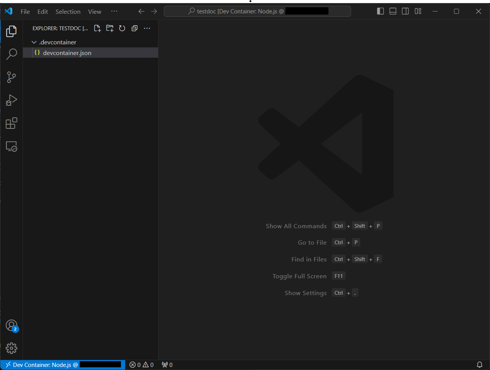

# 1-5 Installation of Docusaurus and Source Control Using Git

In this tutorial, we will install Docusaurus in a Dev Container and perform source control using Git and GitHub.

---

## Requirements

Before starting, ensure you have the following installed and set up:

- **Git**: Install [Git](https://git-scm.com/) for source control.
- **GitHub Account**: Create an account on [GitHub](https://github.com/) if you don’t already have one.
- **Node.js**: Ensure Node.js is installed. You can download it from [nodejs.org](https://nodejs.org/).

---

## Docusaurus Guide

### Step 1: Install Docusaurus

Inside the container's terminal in VS Code, navigate to your project folder. Install Docusaurus by running the following commands:

```bash
npx create-docusaurus@latest my-website classic
```
When prompted to select a language, choose JavaScript.

### Step 2: Start the Docusaurus Development Server

Then, go to `my-website` and start the server.

```bash
cd my-website
npm run start
```

Open your browser and navigate to `http://localhost:3000` to see your Docusaurus site in action.

### Step 3: Start Editing!

In Docusaurus, Markdown is used for creating documentation and content. It is a lightweight markup language used for creating formatted text using plain text. Markdown files typically have the `.md` extension. Start editing those and create your own documentation or notes.

After editing, you will need to build the website again into a directory of static contents to view the changes. To build and serve the website:

```bash
npm run build
npm run serve
```

For more information, visit [here](https://www.markdownguide.org/getting-started/) to get started learning Markdown.

---

## Git Source Control Guide

Git source control is a version control system that tracks changes in files and enables collaborative software development. It allows developers to manage their codebase efficiently by creating snapshots (commits) of their work, which can be reverted or reviewed at any time.

### Step 1: Ensure Git is Installed

Verify whether or not Git has been installed on your system by running:

```bash
git --version
```

If not, install by running:

```bash
sudo apt install git
```

Run `git --version` again to ensure that Git has been installed.

### Step 2: Configure GitHub

Set your username:

```bash
git config --global user.name "Your Name"
```

Set your email:

```bash
git config --global user.email "youremail@example.com"
```

Confirm the configuration:

```bash
git config --list
```

If the configuration is successful, your username and email will be shown.

### Step 3: Initialize the Repository

Open your project folder in VS Code and initialize Git:

```bash
git init
```

Alternatively, you can also select **"Source Control"** at the side panel and click **"Initialize Repository"**.



### Step 4: Stage and Commit Changes

After the initialization, you may start editing your contents. Then, stage and commit your changes in **"Source Control"**.



### Step 5: Publish to GitHub

Next, select **"Publish Branch"** and depending on your preference, publish privately or publicly.


Now, you will be able to see your files on your GitHub repository.

---

## References

- For more information on source control: [Using Git source control in VS Code](https://code.visualstudio.com/docs/sourcecontrol/overview)

- Install **[Docusaurus](https://docusaurus.io/docs/installation)**

---