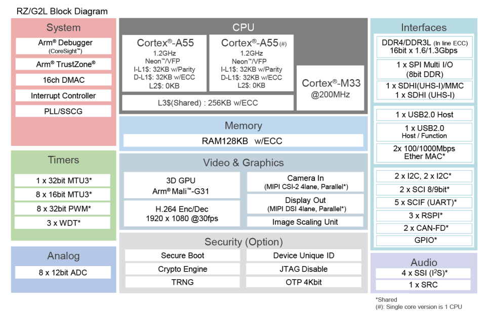

# 2-1 Introduction to Renesas RZ/G2L Development Board

The Renesas RZ/G2L is a reliable and energy-efficient embedded system designed for low-power consumption applications. Below is a summary of key details and instructions for working with the RZ/G2L.

The RZ/G2L hardware block diagram above shows its architecture and features.

To have an overall understanding about RZ/G2L, please check out the [RZ/G2L Evaluation Board Kit Quick Start Guide](./docs/RZG2L%20Evaluation%20Board%20Kit%20Quick%20Start%20Guide.pdf).

The quickest way to start-up RZ/G2L is to download prebuilt images. Please refer to the **Quick Start Procedure** in page 3 of the document above for a step-by-step guide.

---

## References

- [Renesas RZ/G2L Official Website](https://www.renesas.com/en/products/microcontrollers-microprocessors/rz-mpus/rzg2l-general-purpose-mpu-dual-core-arm-cortex-a55-cpus-and-single-core-cortex-m33-cpu-3d-graphics-and)

---