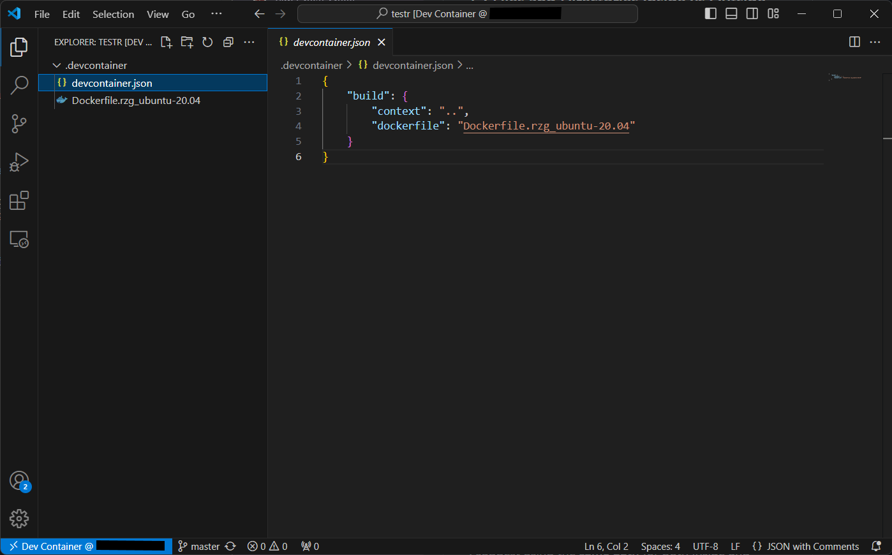
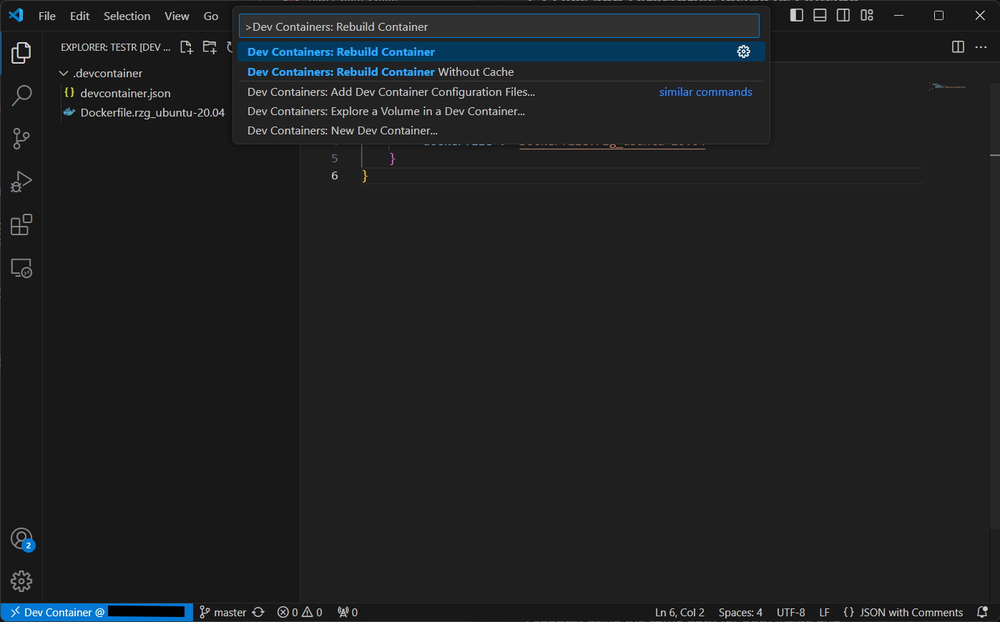

# 2-2 Setup Docker Container to Build Linux BSP for RZ/G2L

In this tutorial, we will learn how to setup a Docker container to build a Linux BSP for RZ/G2L. Then, we will write the image into an SD card and boot up RZ/G2L from it.

---

## Step 1: Modify `devcontainer.json` file

In your Dev Container, navigate to the `devcontainer.json` file under the `.devcontainer` directory. Replace the contents of the file with the code below:

```json title="devcontainer.json"
{
    "build": {
        "context": "..",
        "dockerfile": "Dockerfile.rzg_ubuntu-20.04"
    }
}
```

## Step 2: Add Dockerfile and Rebuild Container

From [here](https://github.com/renesas-rz/docker_setup), download the Dockerfile named `Dockerfile.rzg_ubuntu-20.04` as we will be using Ubuntu version 20.04.

Add the Dockerfile to the `.devcontainer` directory as shown below.



Press `Ctrl + Shift + P` and enter **"Dev Containers: Rebuild Container"** in the **Command Palette**.



The rebuild of the container may take a moment to finish. After this, your container will have all the reqiured packages and dependencies installed.

## Step 3: Download Renesas VLP Packages

Download the packages here: [RZ/G Verified Linux Package [5.10-CIP]](https://www.renesas.com/en/products/microcontrollers-microprocessors/rz-mpus/rzg-linux-platform/rzg-marketplace/verified-linux-package/rzg-verified-linux-package)

These are the packages and patch files that you need to install:

**Packages:**
- **[RTK0EF0045Z0021AZJ-v3.0.6-update3.zip](https://www.renesas.com/en/document/swo/rzg-verified-linux-package-v306-update3rtk0ef0045z0021azj-v306-update3zip?r=1597481)**
- **[RTK0EF0045Z13001ZJ-v1.2.2_EN.zip](https://www.renesas.com/en/document/swo/rz-mpu-graphics-library-evaluation-version-v122-rzg2l-rzg2lc-and-rzv2l-rtk0ef0045z13001zj-v122xxzip?r=1522761)**
- **[RTK0EF0045Z15001ZJ-v1.2.2_EN.zip](https://www.renesas.com/en/document/swo/rz-mpu-video-codec-library-evaluation-version-v122-rzg2l-and-rzv2l-rtk0ef0045z15001zj-v122xxzip?r=1535641)**

**Patch Files:**
- **[0001-gstreamer-moil-plugin.patch](https://m11158002.github.io/moil-renesas/assets/files/0001-gstreamer-moil-plugin-91a25cd4d16fc479aefd2aa853466770.patch)**
- **[0002-fix_qtsmarthome_url.patch](https://m11158002.github.io/moil-renesas/assets/files/0002-fix_qtsmarthome_url-db1d20dcf1b5af60dc7034e78271ddc2.patch)**

## Step 4: Extract the Downloaded Packages

Extract .zip files.

```bash
unzip RTK0EF0045Z0021AZJ-v3.0.6-update3.zip
```
```bash
unzip RTK0EF0045Z13001ZJ-v1.2.2_EN.zip
```
```bash
unzip RTK0EF0045Z15001ZJ-v1.2.2_EN.zip
```

Create a new directory in your Dev Container and move to the working directory.

```bash
mkdir yocto
cd yocto
```

Extract .tar.gz files.

```bash
tar zxvf ../RTK0EF0045Z0021AZJ-v3.0.6-update3/rzg_vlp_v3.0.6.tar.gz
```
```bash
tar zxvf ../RTK0EF0045Z13001ZJ-v1.2.2_EN/meta-rz-features_graphics_v1.2.2.tar.gz
```
```bash
tar zxvf ../RTK0EF0045Z15001ZJ-v1.2.2_EN/meta-rz-features_codec_v1.2.2.tar.gz
```

List out the files in the working directory to verify the package contents.

```bash
ls -1
```

If the output is as follows, the packages are installed correctly.

```
extra
meta-gplv2
meta-openembedded
meta-qt5
meta-renesas
meta-rz-features
meta-virtualization
poky
```

## Step 5: Apply Patch Files

Apply a patch file to update vlp to update3.

```bash
patch -p1 < ../RTK0EF0045Z0021AZJ-v3.0.6-update3/vlpg306-to-vlpg306update3.patch
```

Move to the `meta-renesas` directory.

```bash
cd meta-renesas
```

Apply patch file extras.

```bash
patch -p1 < ../extra/0001-rz-common-recipes-debian-buster-glibc-update-to-v2.2.patch
```
```bash
patch -p1 < ../extra/0001-rz-common-linux-update-linux-kernel-to-the-latest-re.patch
```
```bash
patch -p1 < ../extra/0001-rz-common-gst-plugins-bad-Depending-bayer2raw-if-lay.patch
```

Move back the working directory.

```bash
cd ..
```

Apply a patch file to add the GStreamer Moil Plugin.

```bash
patch -p1 < 0001-gstreamer-moil-plugin.patch
```

Apply a patch file to fix the Qt Smart Home URL.

```bash
patch -p1 < 0002-fix_qtsmarthome_url.patch
```

## Step 6: Initialize and Start Image Build

Initialize a build using the oe-init-build-env script in Poky and set environment variable TEMPLATECONF to the below path.

```bash
TEMPLATECONF=$PWD/meta-renesas/meta-rzg2l/docs/template/conf/ source poky/oe-init-build-env build
```

Run the following commands to add necessary layers for AI application to build/conf/bblayers.conf (configration file for layers).

```bash
bitbake-layers add-layer ../meta-rz-features/meta-rz-graphics
```
```bash
bitbake-layers add-layer ../meta-rz-features/meta-rz-codecs
```

Run the following command to build the weston image.

```bash
MACHINE=smarc-rzg2l bitbake core-image-weston
```

Building images for the first time typically takes a few hours to complete. You may disconnect from the Dev Container during this process.

:::note
To build the qt5 image, run the following command to add the `meta-qt5` layer.

```bash
bitbake-layers add-layer ../meta-qt5
```

If you want to add qt5 demonstration to `core-image-qt`, add the following to your `local.conf` file.

```bash
QT_DEMO = "1"
```

Run the following command to build the qt5 image.

```bash
MACHINE=smarc-rzg2l bitbake core-image-qt
```
:::

## Step 7: Flashing Into SD Card

Exit the Dev Container and reconnect to host. Then, go to the `build/tmp/deploy/images/smarc-rag2l` directory. Under this directory, you will see a list of the output files from the build. 

Sample output files:

```
core-image-qt-smarc-rzg2l.wic.gz
core-image-qt-smarc-rzg2l.wic.bmap
```

Insert the SD card into the PC and check the device ID of the SD card by running:

```bash 
sudo fdisk -l
```

Flash the image into SD card:

```bash
sudo bmaptool copy core-image-qt-smarc-rzg2l.wic.gz /dev/sda
```

:::note
If the flash is unsuccessful, unmount `/dev/sda1` and `/dev/sda2` by running these commands below and try again.

```bash
umount /dev/sdc1
umount /dev/sdc2
```
:::

## Step 8: Booting Up from SD Card

Insert the SD Card into the RZ/G2L board, connect the power input and serial monitor to your personal PC and boot up by long pressing the red button.


Open up the serial monitor in VS Code (ensure you have the Serial Monitor Extension installed first), select the port that is connected to the board, ensure you have toggled Terminal Mode and click on **"Start Monitoring"**.

Reboot by pressing on the blue button on the board. You will start seeing start-up messages on the serial monitor. Once the start-up is complete, you will be prompted for a login. Simply enter `root` to login.


Congratulations! You have successfully booted up the RZ/G2L board. On the next tutorial, we will learn how to add programs to the build and execute the program from the board.

---

## References

- [Linux Start-up Guide](https://www.renesas.com/en/document/gde/smarc-evk-rzg2l-rzg2lc-rzg2ul-linux-start-guide-rev104?r=1467981)

- [Docker Container setup for building a Linux BSP for RZ](https://github.com/renesas-rz/docker_setup)

- [RZ/G2L Quick Start Guide](https://www.renesas.com/us/en/document/qsg/rzg2l-evaluation-board-kit-quick-start-guide)

---