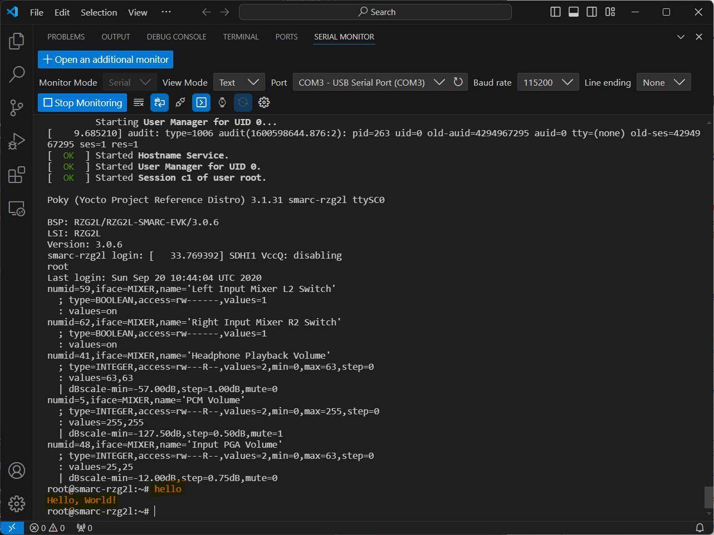

# 2-3 Yocto Layers and Recipe

In this tutorial, we will add a simple Hello World program into the Yocto Project as part of the Linux image. Then, we will execute the program on our target board Renesas RZ/G2L.

---

## Step 1: Create a New Layer

In the directory `workspaces/rzg/yocto`, create a new layer named `meta-test` by running:

```bash
bitbake-layers create-layer meta-test
```

A folder named `meta-test` will be created. The structure of the folder are as follows:

```
.
├── conf
│   └── layer.conf
├── COPYING.MIT
├── README
└── recipes-example
    └── example
        └── example_0.1.bb

```

## Step 2: Add Your Own Program

To add your own program, create a folder named according to your preference in `~/meta-test/recipes-example`. In this case, we will name our folder `hello` and add a simple Hello World program.

```
hello
├── files
│   └── hello.c
└── hello.bb
```

In the `hello` folder, create these files according to the file structure above. 

```c title="hello.c"
# include <stdio.h>

int main(void) {
   printf("Hello, World!\n");
   return 0;
}
```

```bb title="hello.bb"
DESCRIPTION = "Simple Hello World application"

LICENSE = "MIT"

LIC_FILES_CHKSUM = "file://${COREBASE}/meta/COPYING.MIT;md5=3da9cfbcb788c80a0384361b4de20420"

SRC_URI = "file://hello.c"

S = "${WORKDIR}/build"

do_compile() {
    ${CC} ${CFLAGS} ${LDFLAGS} ${WORKDIR}/hello.c -o ${S}/hello
}

do_install() {
    install -d ${D}${bindir}
    install -m 0755 ${S}/hello ${D}${bindir}/
}
```

## Step 3: Edit `bblayers.conf` and `local.conf` Files

Add the `meta-test` folder under `BBLAYERS ?=`:

```conf title="bblayers.conf"
BBLAYERS ?= " \
  ${TOPDIR}/../meta-gplv2 \
  ...
  ${TOPDIR}/../meta-test \
  ...
```

Next, add the name of the recipe to `local.conf` by adding the line below:

```conf title="local.conf"
IMAGE_INSTALL:append = " hello "
```

## Step 4: Rebuild Image

Now, we can rebuild the image with our own program added to the build.

First, initialize the build in the `/workspaces/rzg/yocto` directory.

```bash
source poky/oe-init-build-env build
```

Run the following command to start building the image.

```bash
MACHINE=smarc-rzg2l bitbake core-image-qt
```

:::tip
If you have previously built the qt image, the process usually only takes a few minutes to finish. This is because the cached files are reused and only our program needs to be compiled from scratch.
:::

## Step 5: Testing the Program

In your serial monitor, type in the name of the program and hit `Enter`.

:::note
Follow the previous guide to learn how to flash an image to SD card and boot up from it. 
:::

Your program will be executed and these are the results:



You may also try out different programs, such as a simple calculator:


---

## References

- [How to Build a Hello World Recipe](https://www.wpgdadatong.com/blog/detail/42091)

- [Yocto Tutorial - 08 Creating a Simple Hello World Yocto Recipe](https://www.youtube.com/watch?v=YSITCPhk_qU)

---