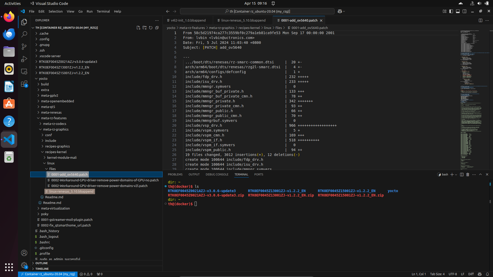

# E-1 Applying OV5640 Driver Patch File to RZ/G2L

This section describes how to add a patch file for the OV5640 camera driver to the Yocto build system for the Renesas RZ/G2L platform.

---

## Download Patch File

First, download the required patch file for the OV5640 driver. This patch file includes modifications to enable support for the OV5640 camera module in the Linux kernel.

[Download OV5640 Driver Patch](./docs/OV5640.patch)

Make sure you save the patch file with a descriptive name like `0001-add_ov5640.patch` so it’s easy to identify.

---

## Copy Patch File to Specified Directory



Next, copy the downloaded patch file into the appropriate directory within your Yocto layers.

```bash
~/yocto/meta-rz-features/meta-rz-graphics/recipes-kernel/linux/files/
```

You can use the following command:

```bash
cp 0001-add_ov5640.patch ~/yocto/meta-rz-features/meta-rz-graphics/recipes-kernel/linux/files/
```

This step ensures that the patch is available to be picked up during the kernel build.

---

## Modify `.bbappend` File
Now, you need to tell Yocto to apply the patch during the build process. To do this, edit the `.bbappend` file for the kernel recipe.

The file is:

```bash
~/yocto/meta-rz-features/meta-rz-graphics/recipes-kernel/linux/linux-renesas_5.10.bbappend
```

Open it in your preferred text editor and add the following lines:

```bash
FILESEXTRAPATHS_prepend := "${THISDIR}/files:"

SRC_URI_append_rzg2l = " \
        file://0002-Workaround-GPU-driver-remove-power-domains-of-GPU-no.patch \
        file://0001-add_ov5640.patch \
"
SRC_URI_append_rzv2l = " \
        file://0002-Workaround-GPU-driver-remove-power-domains-v2l.patch \
"
```

---