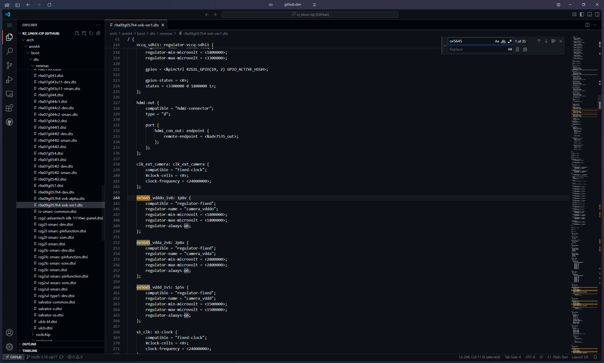
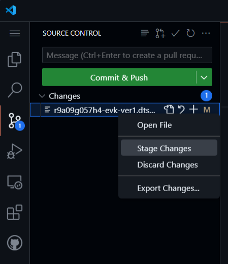
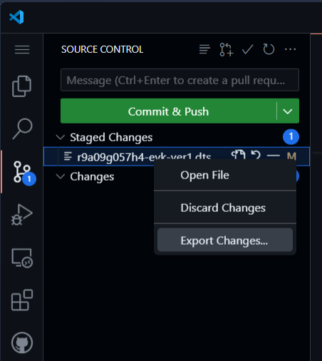

# E-2 Applying OV5640 Driver Patch File to RZ/V2H

This guide provides detailed steps for applying a patch to support the OV5640 camera module on the Renesas RZ/V2H platform.

---

## Step 1: Modify the Device Tree and Kernel Configuration

### Edit the Device Tree Source

:::tip
Edit the link from `github.com` to `github.dev` to enter web editor mode.
:::

Access and modify the appropriate Device Tree Source file:

[Link to `r9a09g057h4-evk-ver1.dts` file](https://github.com/renesas-rz/rz_linux-cip/blob/rzv2h-5.10-cip17/arch/arm64/boot/dts/renesas/r9a09g057h4-evk-ver1.dts)



Make the following changes:
- Replace any instance of `ov5645` with `ov5640` to switch the camera sensor.
- Update `enable_gpios` from `GPIO_ACTIVE_HIGH` to `GPIO_ACTIVE_LOW`.

### Update the Kernel Configuration

Edit the `defconfig` file to enable the OV5640 driver:

[Link to `defconfig` file](https://github.com/renesas-rz/rz_linux-cip/blob/rzv2h-5.10-cip17/arch/arm64/configs/defconfig)

Add the following line:

```
CONFIG_VIDEO_OV5640=y
```

## Step 2: Create and Export the Patch

Stage the modified files.



Export the changes. A `diff` file will be generated.



As there are two files that have been edited, there will be two `diff` files. Merge them together into one single file by using any text editor of your preference. Save and name the file as `0001-add_ov5640.patch`.

## Step 3: Integrate Patch File Into Build

Move the patch file to this directory:

`~/rzv2h/src_setup/yocto/meta-rz-features/meta-rz-graphics/recipes-kernel/linux/files`

Edit `.bbappend` file:

```
FILESEXTRAPATHS_prepend := "${THISDIR}/files:"

SRC_URI_append_rzg2l = " \
        file://0002-Workaround-GPU-driver-remove-power-domains-of-GPU-no.patch \
"
SRC_URI_append_rzv2l = " \
        file://0002-Workaround-GPU-driver-remove-power-domains-v2l.patch \
"

SRC_URI_append_rzv2h = " \
        file://0001-add_ov5640.patch \
"
```

Enter into the directory `~/rzv2h/src_setup/yocto/build`. Then, start the build by running:

```
TEMPLATECONF=${PWD}/meta-renesas/meta-rzv2h/docs/template/conf/ source poky/oe-init-build-env

MACHINE=rzv2h-evk-ver1 bitbake core-image-weston
```

## Step 4: Deploy the Image and Verify Camera Registration

Burn the image named `core-image-weston-rzv2h-evk-ver1.wic.gz` into an SD card. You may refer to **Step 8** of [2-2](./2-2.md).

Use the following command to inspect media device nodes:

```
media-ctl /dev/media0 -p
```

Confirm that the OV5640 camera is detected and registered correctly by the CRU (Camera Receiver Unit).

## Step 5: Configure Camera Preview Script

Open the preview.sh script.

Modify its contents based on the media-ctl output to correctly map the camera and video device nodes.

Run the script to start the camera preview and verify functionality.

---