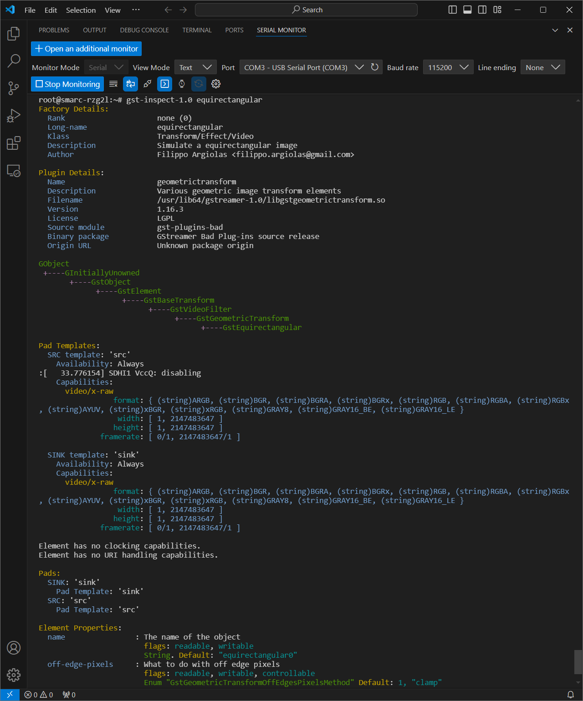

# 3-5 Editing Recipes and Recompiling Yocto Project

This tutorial guides you on configuring and compiling the Yocto project to include a custom `equirectangular` GStreamer plugin.

Before we start, ensure you have a **Docker container** set up for Yocto project compilation.

:::note

Refer to [Section 2-2](../week-2/2-2.md) for detailed instructions on setting up the Yocto build environment.

:::

---

## Step 1: Modify the Yocto Project Configuration

Navigate to the following file in your Yocto project folder:

```
meta-renesas/meta-rz-common/recipes-multimedia/gstreamer/gstreamer1.0-plugins-bad_1.16.3.bbappend
```

Modify the first line in the `SRC_URI_append` section to point to your repository:

```
SRC_URI_append = " \
git://github.com/yourskc/gst-plugins-bad.git;branch=RCAR-GEN3e/1.16.3 \
```

Add the following line to specify the commit ID to be used and replace `commit ID` with the actual commit ID:

```
SRCREV="commit ID"
```

## Step 2: Recompile and Flash Yocto Image

Run the following command to build the image:

```bash
MACHINE=smarc-rzg2l bitbake core-image-qt
```

Next, use the `bmaptool` command to flash the image to your SD card:

```bash
sudo bmaptool copy image.wic.gz /dev/sdX
```

Replace `image` with the name of your image file and `/dev/sdX` with the appropriate SD card device.

## Step 3: Verify on RZ/G2L Board

Boot the RZ/G2L board and verify the presence of the `equirectangular` element in the GStreamer library:

```bash
gst-inspect-1.0 equirectangular
```

The output should confirm the existence of the `equirectangular` element.



## Step 4: Prepare the Working Directory and Transfer Test Data

On the RZ/G2L board, create a working directory:

```bash
cd /home/root
mkdir gst-work
cd gst-work
```

Use `scp` to copy the test environment files to the RZ/G2L board:

```bash
scp -r user@IP:/path/to/test_env/* .
```

Verify that `EquimatX` and `EquimatY` are in the directory before running the GStreamer pipeline with the `equirectangular` filter.

:::tip[Additional Info]

For a resolution of 1920 x 1080, the size of the X and Y map files can be calculated as:

```
1,920 x 1,080 x 4 + 16 = 8,294,416 bytes
```

Each point requires 4 bytes, and the files include an additional 16-byte header.

:::

---