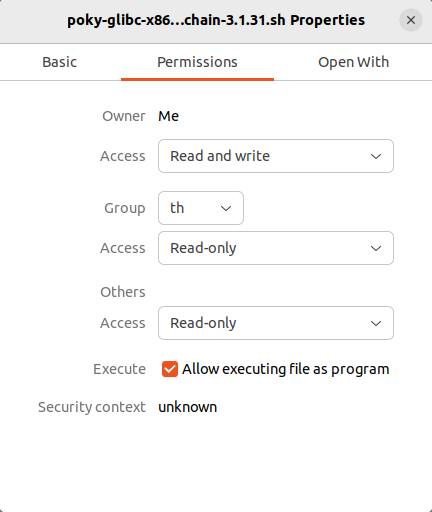

# 4-2 Preparing the Toolchain

We need to compile the Yocto project to create the toolchain that will be installed on the system. We'll use them when we configure the compiler, debugger and Qt version in the settings of Qt Creator later.

---

## Step 1: Compile the Yocto Project

Build the Yocto project with the appended `-c populate_sdk` parameter to generate the SDK toolchain:

```bash
MACHINE=smarc-rzg2l bitbake core-image-qt -c populate_sdk
```

This process must be done within a Docker container running on Ubuntu.
Refer to the [Linux Start-up Guide](https://www.renesas.cn/cn/zh/document/gde/smarc-evk-rzg2l-rzg2lc-rzg2ul-linux-start-guide-rev103?r=1467981) (Page 39: Building the SDK) in the Renesas documentation for additional details.

## Step 2: Locate the Output Script

After the build, the output script for installing the toolchain will be found at:

```
<work_dir>/build/tmp/deploy/sdk/poky-glibc-x86_64-core-image-qt-aarch64-smarc-rzg2l-toolchain-3.1.31.sh
```

## Step 3: Prepare the Installation Script

Right-click on the script file and enable execution permissions by selecting the checkbox for **Permission / Allow executing file as program**.



## Step 4: Install the Toolchain

Run the installation script on your Ubuntu 22.04 system using:

```bash
sudo sh ./poky-glibc-x86_64-core-image-qt-aarch64-smarc-rzg2l-toolchain-3.1.31.sh
```

The toolchain will be installed at:

```
/opt/poky/3.1.31
```

All tools in the /opt/poky/3.1.31 folder will be used to configure the **Kits Settings** in Qt Creator.