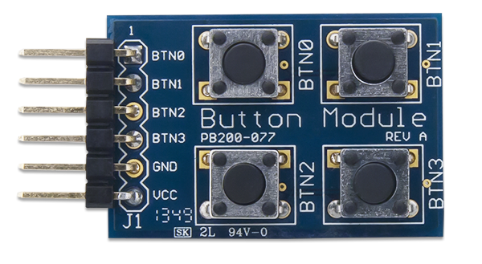
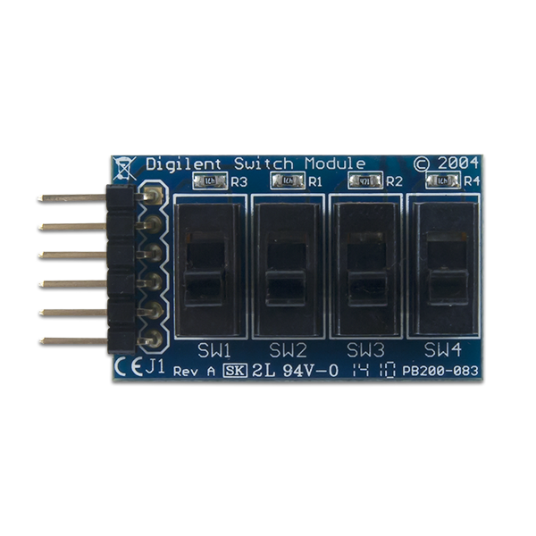
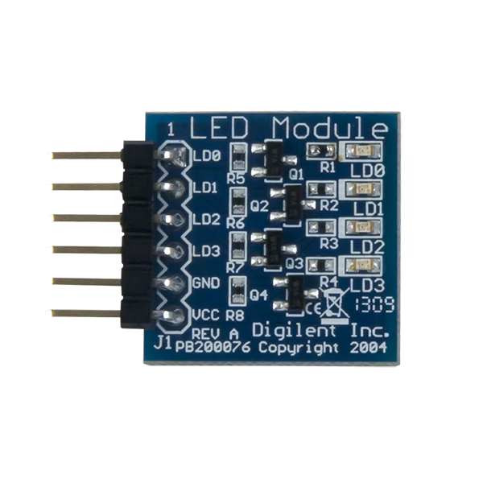
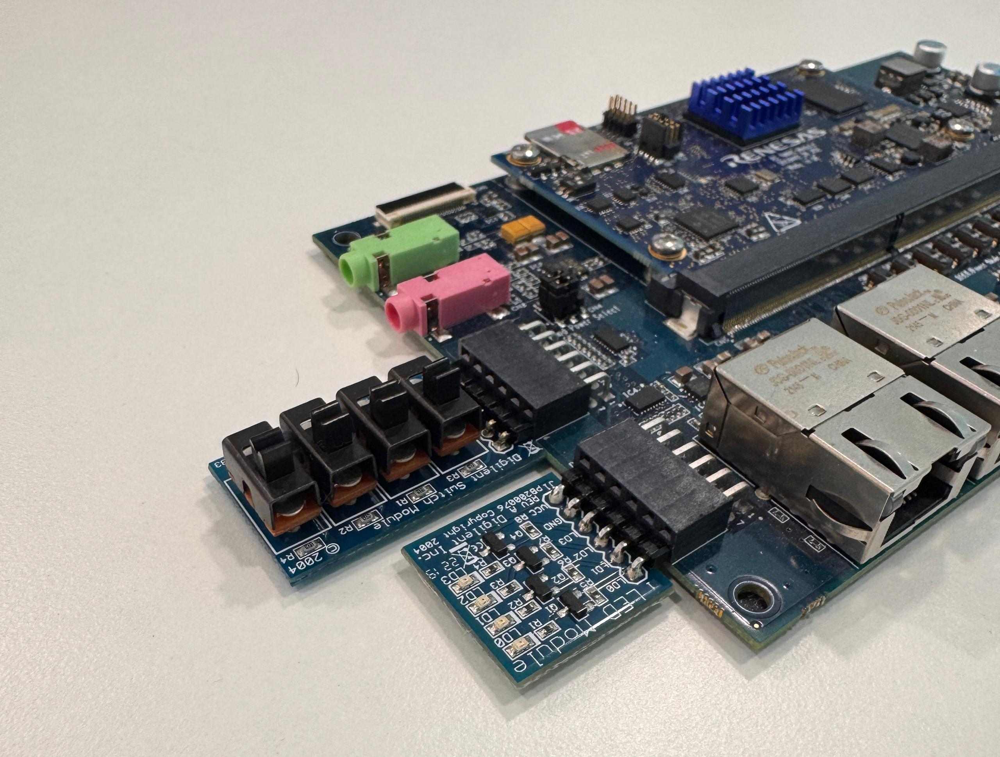

# 4-6 Introduction to RZ/G2L GPIOs

This chapter demonstrates how to test and develop programs to control the GPIO hardware pins on the Renesas RZ/G2L platform within a Linux environment. It covers using Linux Sysfs to manage GPIOs via file-based read/write commands.

---

## Linux Sysfs

Sysfs is a pseudo-filesystem in Linux that provides a way to interact with kernel subsystems, hardware devices, and drivers via virtual files.

To read a file, use the following command:

```bash
cat filename
```

To write to a file, use:

```bash
echo xxx > filename
```

## Accessing GPIO Pins

To access GPIO privileges on the RZ/G2L broad, navigate to `/sys/class/gpio/` and export the desired GPIO pin ID:

```bash
echo gpio-pin-id > export
```

:::tip[Renesas GPIO Pin IDs]

GPIO Pin IDs are calculated based on the port and pin as outlined in page 8 of [Renesas GPIO documentation](./docs/R01US0405EJ0111_GPIO_UME_v1.11.pdf). For RZ/G2L, the formula is shown below:

```
GPIO ID = (Port Number * 8) + Pin Number + 120
```

For **P42_4 (*Port 42, Pin 4*)**:

```
GPIO ID = (42 * 8) + 4 + 120 = 460
```

:::

After exporting the pins, a directory named after your pin (e.g. P42_4) will be created under the `/sys/class/gpio/` directory. Enter into the directory and use the command `ls` to list all the files.

The output will be:

```
active_low  device  direction  edge  power  subsystem  uevent  value
```

## Controlling GPIO Pins

To control GPIO pins, please ensure that you are in the `sys/class/gpio` directory.

**Setting Pin Direction**

```bash
echo "out" > direction
echo "in" > direction
```

**Writing Values To Pin**

```bash
echo 1 > value
echo 0 > value
```

**Reading The Pin State**

```bash
cat value
```

## Hardware Testing Through PMOD Interface

The **PMOD (Peripheral Module)** interface is a standardized connector used to interface peripheral modules with a host device, such as development boards, microcontrollers, or FPGAs. Developed by Digilent, PMOD connectors typically use a 6-pin or 12-pin header configuration, carrying signals such as power, ground, and data lines for SPI, I2C, UART, or GPIO communication. Designed for simplicity and flexibility, PMOD modules offer plug-and-play compatibility, enabling developers to easily add functionality like sensors, displays, and communication modules to projects without the need for complex wiring or additional circuitry.

**[PMOD Button](https://digilent.com/reference/pmod/pmodbtn/start)**



**[PMOD Switch](https://digilent.com/reference/pmod/pmodswt/start)**



**[PMOD LED](https://digilent.com/reference/pmod/pmodled/start)**



Clone the GitHub repository below and build it in Qt Creator using the RZ/G2L kit.

```bash
git clone https://github.com/yourskc/q563_rzgpio.git
```

To match the configuration of the software program, please plug in the PMOD switch and LED according to the picture shown below. The PMOD switch should be connected to the 6 lower pins of `PMOD1`, and the PMOD LED should be connected to the 6 lower pins of `PMOD`.



Transfer the executable to RZ/G2L and run it. Try out the program and observe the output.

---