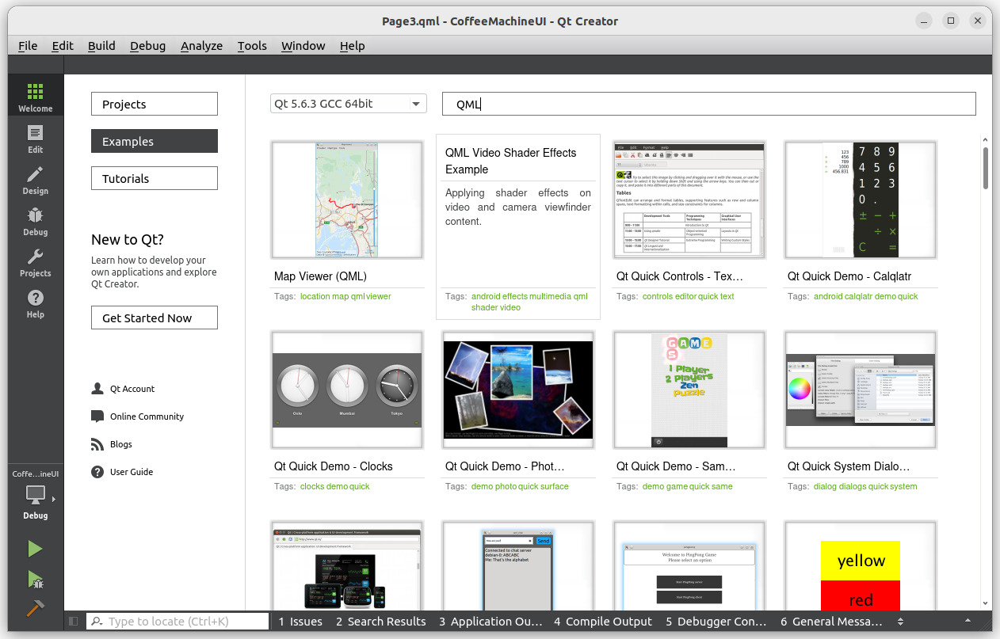

# 5-1 Introduction to QML and Qt Quick

**QML (Qt Modeling Language)** is a user interface markup language used for designing UI-focused applications. It is declarative, similar to CSS and JSON, making it easy to create dynamic user interfaces.

**Example:**

```qml
import QtQuick

Rectangle {
    id: canvas
    width: 250
    height: 200
    color: "blue"

    Image {
        id: logo
        source: "pics/logo.png"
        anchors.centerIn: parent
        x: canvas.height / 5
    }
}
```

For more examples, visit:  
[QML on Wikipedia](https://en.wikipedia.org/wiki/QML)

## Qt Quick

Qt Quick is an open-source application framework developed and maintained by the Qt Project. It is part of the Qt framework and enables the creation of highly dynamic graphical user interfaces with smooth transitions and effects, which are especially common in mobile applications.

Qt Quick includes a declarative scripting language called QML, which is interpreted at runtime by Qt Declarative. This interpreter reads the QML-based UI definitions and renders them accordingly. Additionally, QML allows JavaScript integration for implementing application logic.

## Prerequisites
Before proceeding, ensure that you have followed the setup instructions in Sections **4-1** to **4-4** to prepare your development environment for Qt cross-compilation.

By default, the Renesas SDK is installed at `/opt/poky/{version}`. Multiple SDKs can be maintained in separate directories. For example:

```bash
/opt/poky/3.1.31
/opt/poky/3.1.31_v2h
```

The folder `3.1.31` is for RZ/G2L.

The folder `3.1.31_v2h` is for RZ/V2H.

---

## Developing QML Applications
In this chapter, we will learn how to create QML applications. Most of the time, we will compile and run the application using Desktop GCC (64-bit).

Later, we will modify the target SDK kit settings to build versions for RZ/G2L or RZ/V2H.

## Launching Qt Creator
The launch Qt Creator, enter the following command in your terminal:

```sh
cd /opt/poky/3.1.31
unset LD_LIBRARY_PATH
. environment-setup-aarch64-poky-linux
cd ~/Qt5.6.3/Tools/QtCreator/bin
./qtcreator
```

Once inside Qt Creator, three different kit settings will be available for selection.

## Learning Through Examples
A great way to learn QML is by exploring the built-in examples available in Qt Creator.

Click on **Welcome** in the left panel, then the **Examples** section.



To find QML-related examples, search for "Quick" or "QML".

## Cross-Compiling a Qt Project Using `qmake`
Set the SDK environment variables as described above.

Navigate to your project directory, e.g., the "analogclock" project folder.

Run:

```sh
qmake analogclock.pro
```

This will generate a Makefile.

Compile the project by running:

```sh
make
```

This will compile and link the project, generating an executable.

Verify the output format by running:

```sh
file ./analogclock
```

Expected output:

```python-repl
... ARM aarch64 ...
```

---