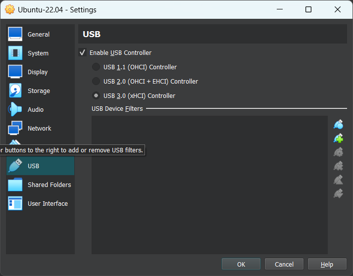
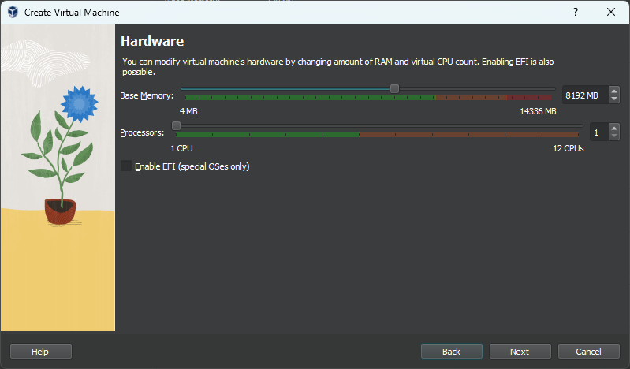

# 4️⃣ Creating a Virtual Machine

A Virtual Machine (VM) is a software-based emulation of a physical computer. It runs as an isolated environment on a physical machine, simulating the functionality of hardware to allow the installation and execution of operating systems and applications.

**How It Works**

- **Host Machine**: The physical computer running the virtual machine software.
- **Guest OS**: The operating system installed on the virtual machine.
- **Virtual Hardware**: VMs simulate hardware components such as processors, memory, and disk storage.

  
Advantages of Virtual Machine

- **Resource Efficiency**: Run multiple OSes on a single physical machine.
- **Testing and Development**: Safe environment for testing new software or configurations.
- **Isolation**: Malfunctions or crashes in one VM do not affect others.
- **Portability**: VMs can be moved between different hardware systems.

## Step 1: Install VirtualBox

From the [VirtualBox official website](https://www.virtualbox.org/), download the appropriate installer for your operating system (Windows, macOS, or Linux) and run the installation.

Run the downloaded installer and follow the installation instructions.

- For Windows: Click Next, accept defaults, and click Install.
- For macOS: Drag VirtualBox to the Applications folder.

:::tip
**Download the Extension Pack (optional but recommended):**
On the [VirtualBox Downloads page](https://www.virtualbox.org/wiki/Downloads), download the Extension Pack for added features like USB support.
Open VirtualBox, Go to **File** > **Preferences** > **Extensions** and add the downloaded Extension Pack.
:::

## Step 2: Download the Operating System (ISO File)

Obtain the ISO file of the operating system you want to install (e.g., Windows 10, Ubuntu Linux).

For Windows, you can download the ISO from [Microsoft](https://www.microsoft.com/en-us/software-download/).

For Ubuntu, visit [Ubuntu's official website](https://releases.ubuntu.com/).

## Step 3: Create a New Virtual Machine

Open VirtualBox and click **New**.

- Give your VM a Name (e.g. "Ubuntu VM").
- Select the ISO image that you have downloaded.
- VirtualBox will automatically detect the **Type** and **Version**. If not, select it manually.

Click **Next** and configure the unattended guest OS install by modifying username, password, and hostname.

## Step 4: Resource Allocation

### Assign RAM  
Allocate memory (RAM) for your VM.

For Ubuntu, set at least 2048 MB (2 GB) and avoid exceeding half of your physical RAM.

### Assign Processors 
Allocate the number of CPUs to your VM.

Start with 1 or 2 cores and increase only if needed.

It is **not** advisable to assign more than 50% of your CPU cores as the host still needs CPU power to manage the VM.

### Create a Virtual Hard Disk  
Select **Create a Virtual Hard Disk Now**. Then, set the disk size (e.g. 20 GB) and click **Next**.

You will be show a table that summarizes the configuration you have chosen for the new virtual machine. When you are happy with the configuration, press **Finish** to create the virtual machine. Alternatively you can go back and modify the configuration.

## Step 5: Start the Virtual Machine

In VirtualBox, select your VM and click **Start**.
The VM will boot from the ISO file (like a real computer booting from a CD/USB).

## Step 6: Install the Operating System
Follow the on-screen instructions for the OS installation:

- For **Windows**, select "Install Now" and follow prompts.
- For **Ubuntu**, select "Install Ubuntu" and follow the setup process.

Complete the installation by creating a username, password, and setting up the system.

:::tip
Take Snapshots before making major changes to revert back easily.

Customize settings like network, USB ports, and shared folders from the Settings menu.
:::

You’re Done! 🎉
You now have a fully functioning virtual machine running in VirtualBox.

---