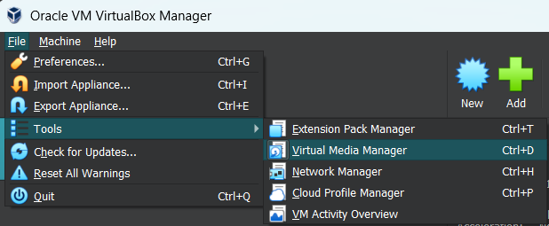
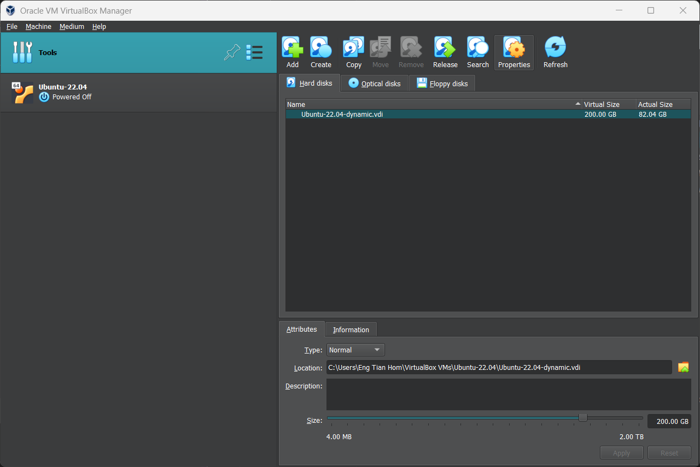
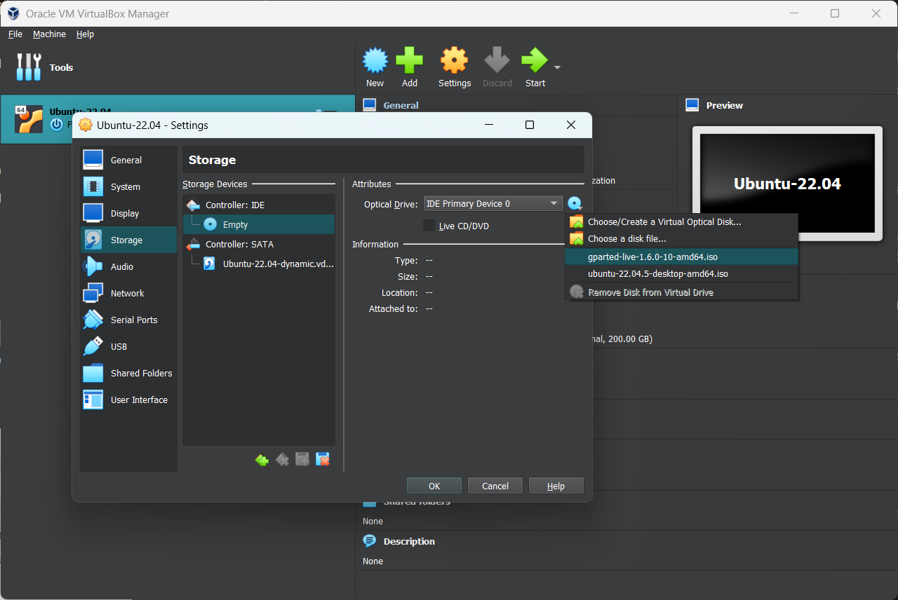
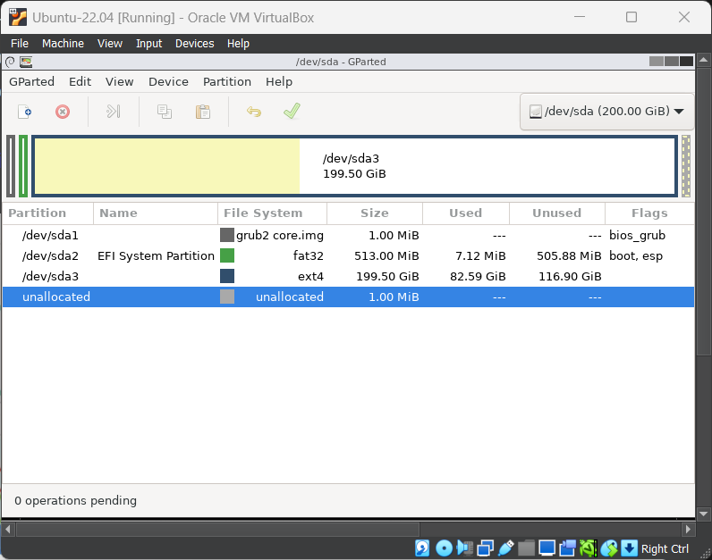
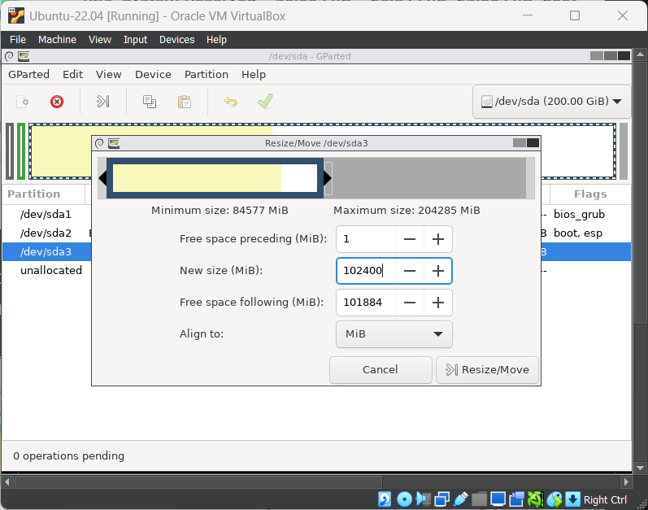
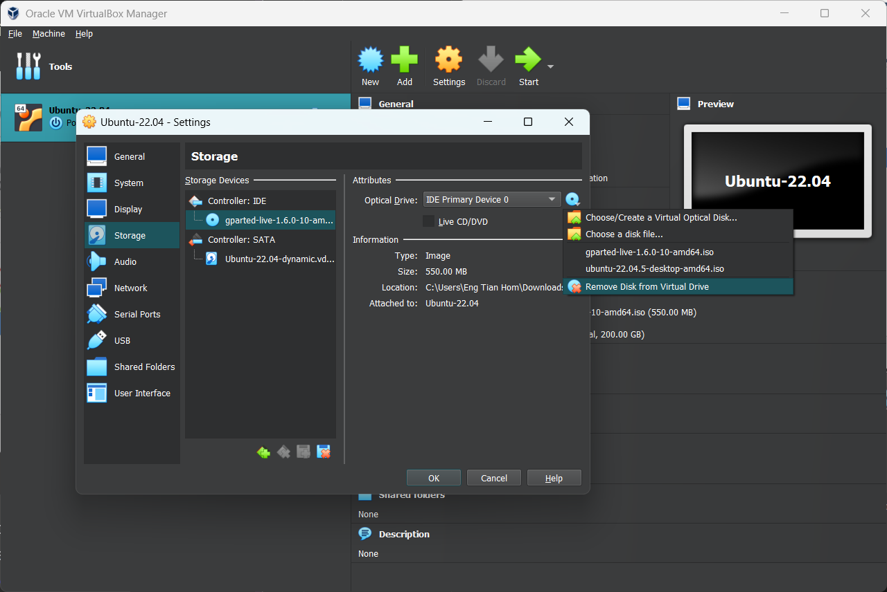

# How to Enlarge a VM's Disk in VirtualBox

Enlarging a virtual disk in VirtualBox requires two main steps: resizing the virtual disk and expanding the partition within the guest operating system to utilize the new space.

## Step 1: Resize the Virtual Disk

:::warning
Before proceeding, back up your `.vdi` file to prevent data loss in case of an issue.
:::

There are two options to resize the virtual disk.

### Option 1: Using Virtual Media Manager

In **VirtualBox Manager**, go to **File** > **Tools** > **Virtual Media Manager**.



Next, select the hard disk associated to your virtual machine. Use the slider below to select the desired size and click **Apply**.



### Option 2: Using Commands

Before making any changes, ensure that the virtual machine is **powered off**. 

Open a **Command Prompt** on your host Window machine and navigate to the VirtualBox installation directory.

```bash
cd "C:\Program Files\Oracle\VirtualBox"
```

Resize the disk using the following command:

```bash
VBoxManage modifymedium disk "C:\Path\To\YourDisk.vdi" --resize <NewSizeInMB>
```

Replace `<NewSizeInMB>` with the desired size (e.g. `204800` for 200GB).

You now have a larger virtual hard disk. However, the operating system's partition on your virtual hard disk is the same size, so you won't be able to access any of this space yet.

## Step 2: Extend the Partition in Guest OS

After resizing the disk, the new space will appear as unallocated. Extend the partition to use it.

You can use a GParted live CD to resize your virtual machine's partition — simply boot the GParted ISO image in your virtual machine and you'll be taken to the GParted partition editor in a live Linux environment.

You can download the GParted live CD's ISO file [here](http://gparted.sourceforge.net/download.php).

Load the ISO file into your virtual machine by going into the virtual machine's settings window.



Restart your virtual machine after inserting the ISO image and the virtual machine will boot from the ISO image. 

GParted's live CD will ask you several questions while booting — you can press Enter to skip them for the default options.

Once GParted is booted, you can look at how the virtual drive is partitioned.



To resize the partition, simply right-click and select **Resize/Move**. A new window will appear that lets you move the partition.



Enter the number after **"Maximum Size"** into the **"New Size"** field, or drag the right-hand side of the slider all the way to the right.

Click the green check mark button near the top to apply all of the changes you've made. Don't be worried if you have to wait a while. Applying the changes can take a few minutes, depending on how many move or resize operations you have queued, and how fast your computer is.

After the resize operation completes, remove the GParted ISO file and restart your virtual machine.



The virtual machine's partition will now take up the entire virtual hard disk, so you'll have access to the additional space.

---