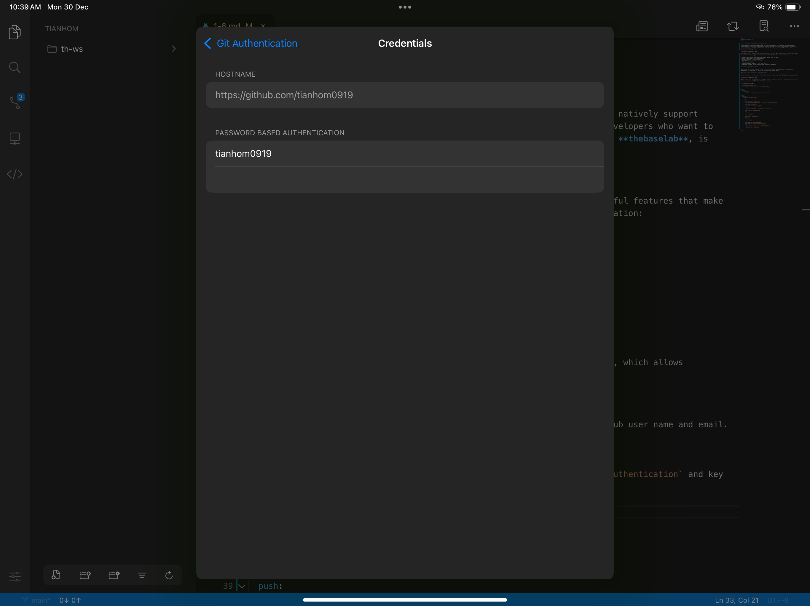

# 6️⃣ Code App for Docusaurus Documentation

iPadOS hasn’t historically been ideal for code development, as it doesn’t natively support robust editors like Visual Studio Code. However, there’s good news for developers who want to code on the go! A fantastic alternative called **Code App**, developed by **thebaselab**, is available on the App Store.


Code App brings a desktop-class coding experience to your iPad with powerful features that make it perfect for building and maintaining projects. These features include:

- Robust Text Editor powered by the Monaco Editor from VS Code
- First class local file system support
- Extensive local language support
- SSH/FTP remote connection support
- Git Version Control
- Package manager support (`pip` and `npm`)
- Markdown, themes, server-side snippet execution and more

## Setting Up GitHub Actions

One of the very useful feature of the **Code App** is Git Version Control, which allows management of your code. To set it up, follow these steps below:

### Step 1: Set Up Identity and Credentials

Go to `Settings > Version Control > Author Identity`, and enter your GitHub user name and email.


Next, set up your credentials by going to `Settings > Version Control > Authentication` and key in your user name and PAT (Personal Access Token). If you don't have a PAT created, please click [here](https://docs.github.com/en/authentication/keeping-your-account-and-data-secure/creating-a-personal-access-token$0) to learn how to create one.



### Step 2: Cloning a repository

To clone a repository, click the source control icon located in the sidebar and enter the url to the repository under **CLONE REPOSITORY**.


```yml title="deploy.yml"
name: Build and Deploy Docusaurus to GitHub Pages

on:
  push:
    branches:
      - main  # Trigger on push to 'main' branch

jobs:
  deploy:
    runs-on: ubuntu-latest

    steps:
    - name: Checkout repository
      uses: actions/checkout@v3  # Fetch the repository code

    - name: Set up Node.js
      uses: actions/setup-node@v3
      with:
        node-version: 20  # Use Node.js version 20

    - name: Install dependencies
      run: |
        cd dir
        yarn install

    - name: Build the website
      run: |
        cd dir
        yarn build

    - name: Deploy to GitHub Pages
      uses: peaceiris/actions-gh-pages@v3
      with:
        github_token: ${{ secrets.GITHUB_TOKEN }}
        publish_dir: dir/build
```

---