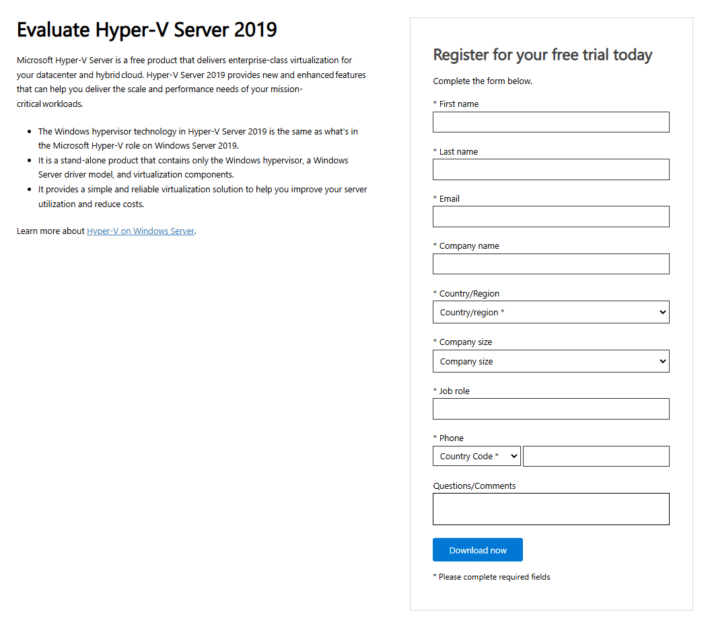
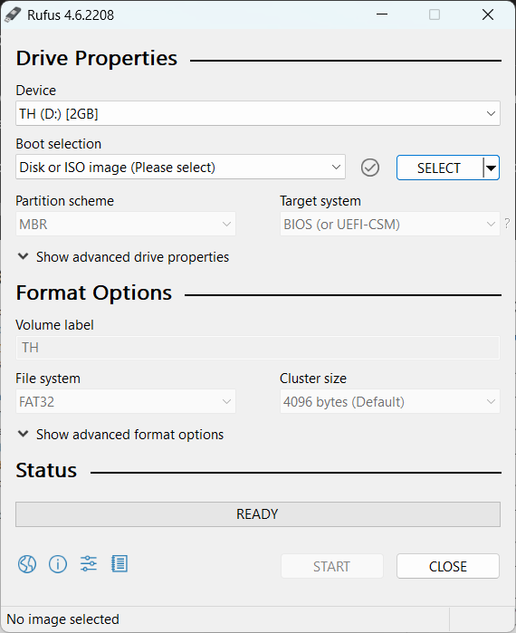

# 7️⃣ Installing Hyper-V Server 2019

Microsoft Hyper-V Server is a virtualization platform used for creating and managing virtual machines (VMs). It allows multiple operating systems to run on a single physical server, making it useful for businesses and IT environments that need efficient resource utilization, isolation, and scalability.

Hyper-V Server 2019 is a standalone, free version of Microsoft's Hyper-V hypervisor but lacks a GUI and requires command-line management (PowerShell or remote tools like Hyper-V Manager). It is different from the Hyper-V role available in Windows Server, which includes additional management features.

---

## Step 1: Register and Download the ISO Image

To install Hyper-V Server 2019, you first need to download the installation media from Microsoft's official website. Follow these steps:

Visit the [Microsoft Evaluation Center](https://www.microsoft.com/en-us/evalcenter) and locate the download page for **Hyper-V Server 2019**.

You will be prompted to register for an account.

After the registration is complete, download the Hyper-V Server 2019 ISO file.

## Step 2: Create a Bootable USB Drive

After downloading the ISO file, create a bootable USB drive to install Hyper-V Server 2019 on your target machine. In this tutorial, we will be using Rufus.

Download Rufus from [here](https://rufus.ie/en/) and launch it.

Select your USB drive in the "Device" section. Then, click "Select" and browse for the Hyper-V Server 2019 ISO.

Choose GPT or MBR partition scheme based on your system (UEFI uses GPT, Legacy BIOS uses MBR).

Click "Start" to create the bootable USB.

## Step 3: Boot from USB and Install Hyper-V Server 2019

Insert the bootable USB into the target machine. Restart the machine and enter the BIOS/UEFI settings (usually by pressing F2, F12, Del, or Esc during boot).

Set the USB drive as the first boot device.

Save changes and reboot the machine.

When the setup loads, choose your language, time, and keyboard preferences, then click Next.

Click Install now.

Accept the license agreement and select Custom: Install Hyper-V Server only.

Choose the disk where you want to install Hyper-V Server and click Next.

The installation process will begin and may take several minutes.

## Step 4: Initial Configuration

Once installation is complete, your server will reboot, and you’ll be prompted to set an administrator password.

Enter a strong password and confirm it.

You will be taken to a command-line interface (CLI). Use sconfig to perform initial configurations.

Basic Configuration with sconfig

Run sconfig and configure the following:

Option 1: Set a computer name.

Option 2: Configure the network settings (IP, DNS, etc.).

Option 3: Join a domain if necessary.

Option 4: Enable remote management.

## Step 5: Connecting to Hyper-V Server Remotely

Since Hyper-V Server 2019 lacks a GUI, you need to manage it remotely.

Using Hyper-V Manager (Windows 10/11)

Open Turn Windows features on or off and enable Hyper-V Management Tools.

Open Hyper-V Manager and click Connect to Server.

Enter the IP address or hostname of your Hyper-V Server.

Authenticate and start managing your virtual machines.

:::tip[Alternative: Windows Admin Center]

:::

---

## Conclusion

You have successfully installed and configured Microsoft Hyper-V Server 2019! You can now create and manage virtual machines using remote tools like PowerShell or Hyper-V Manager. For advanced configurations, consider setting up failover clustering, storage migration, and network virtualization.

---