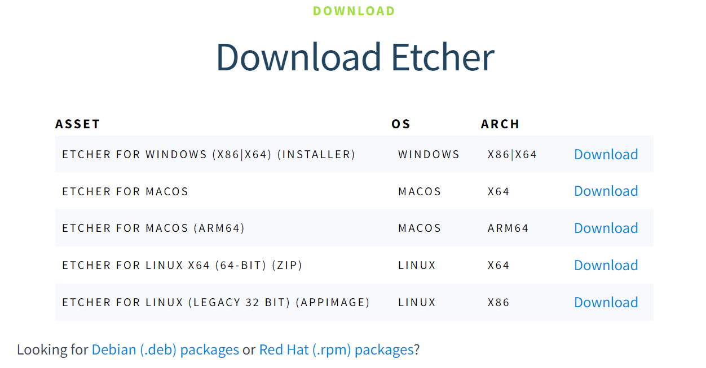
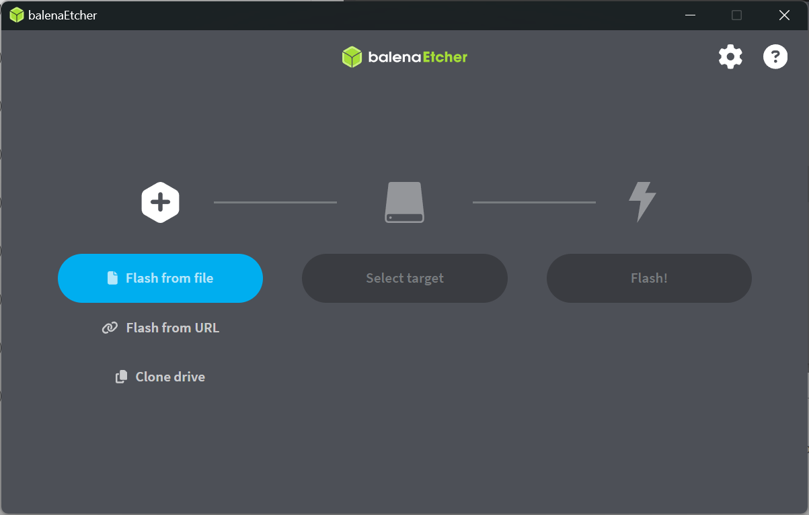
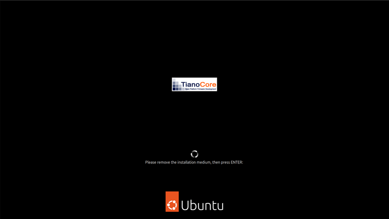
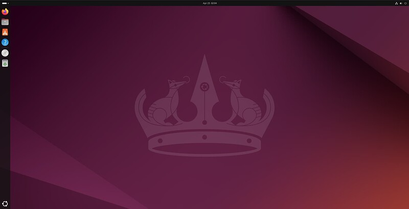

# 1-1 Installation of Ubuntu

In this tutorial, I will guide you through the steps required to install Ubuntu Desktop on your laptop or PC.  

---

## Requirements

- Laptop or PC with at least 25GB of space.
- A USB drive (12GB or above).

---

## Steps

### Step 1: Download an Image of Ubuntu
You can download an Ubuntu image file from [here](https://mirror.twds.com.tw/ubuntu-releases/). Select the version that you need and download will start automatically.  

### Step 2: Create a Bootable USB Drive
We cannot just copy the ISO file, we need a software to write ISO images to USB drives so that it is bootable. In this case, we will use [balenaEtcher](https://etcher.balena.io/) to write our downloaded ISO to a USB drive to create an installation media.  

Select the version that corresponds to your operating system and click download.  

Open **balenaEtcher**, select the ISO file that you have downloaded, select the target USB drive and hit **"Flash!"**. This process may take a while to finish.  

### Step 3: Boot Up from USB Drive
Insert the USB drive into the laptop or PC you want to install Ubuntu and boot or restart it. If it does not recognize the installation media automatically, restart the device and repeatedly press `F12` or `del` on your keyboard to enter BIOS.

:::tip

Different manufacturers have different BIOS key bindings. Common BIOS keys by brand include:
- Acer: `F2` or `DEL`
- ASUS: `F2` or `DEL`
- Dell: `F2` or `F12`
- HP: `ESC` or `F10`
- Lenovo: `F2` or `Fn + F2`
- MSI: `DEL`

:::

Depending on the system-specific boot menu, select the USB drive and boot up from it.

### Step 4: Installation Setup
Different Ubuntu versions have varying installation interfaces. Generally, you can follow the on-screen installation wizard to select your installation type, create a username and login credentials, set keyboard and language preferences, choose a region, and so on. Once these steps are complete, click **Install** to begin the installation process. 

After the installation is finished, you will be prompted to reboot your device and remove the USB drive.  

Once you've done this, hit `Enter`, log in with your username and password, and that's it—you’ve successfully installed Ubuntu Desktop!

---

## References

- [Install Ubuntu Desktop](https://ubuntu.com/tutorials/install-ubuntu-desktop#1-overview)