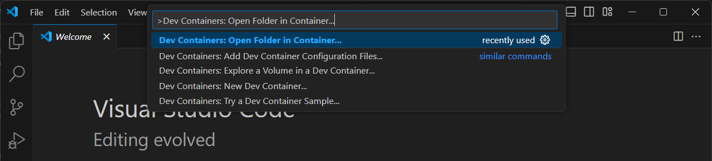
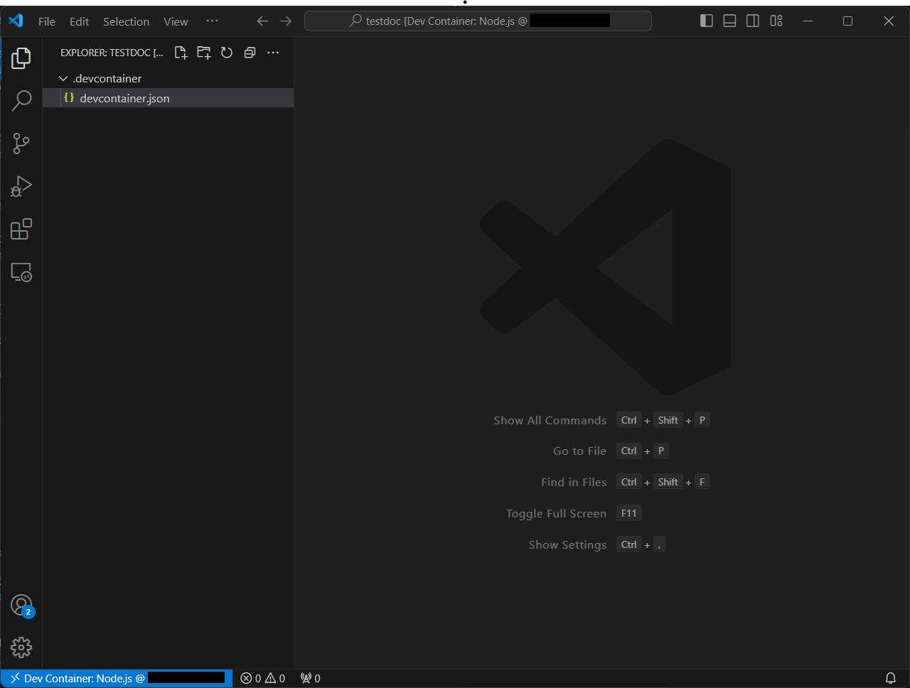

# 1-4 Creating Dev Containers

In this tutorial, we will learn how to create Dev Containers in VS Code.

---

## Prerequisites

Before proceeding, ensure you have the following installed on your system:

- **Visual Studio Code (VS Code)**  
  [Download here](https://code.visualstudio.com/).

- **Remote - Containers Extension**  
  Install the Remote - Containers extension in VS Code from the Extensions Marketplace.

---

## Step 1: Create A Folder for Your Project

Once you have established an SSH connection with your Linux host in VS Code, open up the terminal by Use the code below to create a directory for your dev container:

```bash
mkdir my-dev-container
cd my-dev-container
```

## Step 2: Open Folder In Container

In VS Code, hit `Ctrl + Shift + P` to open up the **Command Palette**. Insert **"Dev Containers: Open Folder in Container..."** and hit `Enter`.



You will be prompted to select a folder to open the container. Select the folder you have just created: `my-dev-container`. 

## Step 3: Configure Dev Container

Now, you will need to configure your Dev Container, select **Add configuration to workspace** > **"Node.js & JavaScript"** > **"20-bookworm"** and click **"OK"**.



And thats it! You have successfully created a Dev Container. Now, you can start developing inside this isolated environment with all the neccessary tools and dependencies.

:::tip

To build a Docker container with all the dependencies needed for development, add the Dockerfile into the `.devcontainer` directory and select **Rebuild Container**.

:::

---

## References

- [Developing Inside a Container](https://code.visualstudio.com/docs/devcontainers/containers)

---