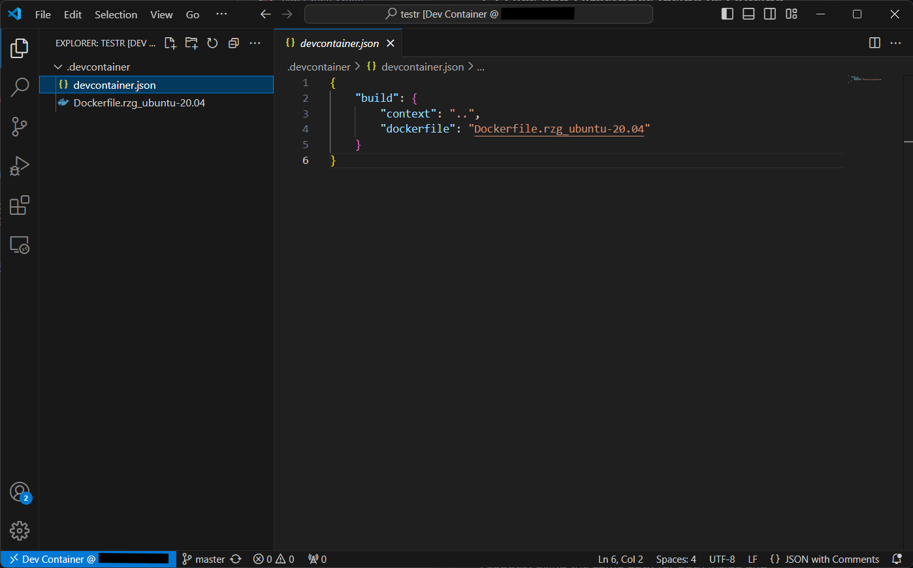
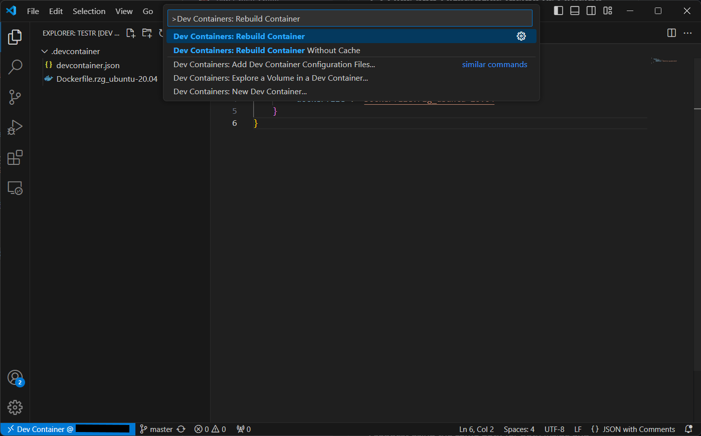

# 2-1 Setup Docker Container to Build Linux BSP for RZ/G2L

In this tutorial, we will learn how to setup a Docker container to build a Linux BSP for RZ/G2L. Then, we will write the image into an SD card and boot up RZ/G2L from it.

## Docker Container Setup

### Step 1: Modify `devcontainer,js` file

In your Dev Container, navigate to the `devcontainer.js` file under the `.devcontainer` directory. Replace the contents of the file with the code below:

```json title="devcontainer.json"
{
    "build": {
        "context": "..",
        "dockerfile": "Dockerfile.rzg_ubuntu-20.04"
    }
}
```

### Step 2: Add Dockerfile and Rebuild Container

From [here](https://github.com/renesas-rz/docker_setup), download the Dockerfile named `Dockerfile.rzg_ubuntu-20.04` as we will be using Ubuntu version 20.04.

Add the Dockerfile to the `.devcontainer` directory as shown below.



Press `Ctrl + Shift + P` and enter **"Dev Containers: Rebuild Container"** in the **Command Palette".



The rebuild of the container may take a moment to finish. After this, your container will have all the reqiured packages and dependencies installed.

### Step 3: 