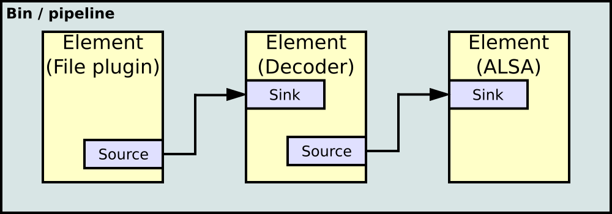
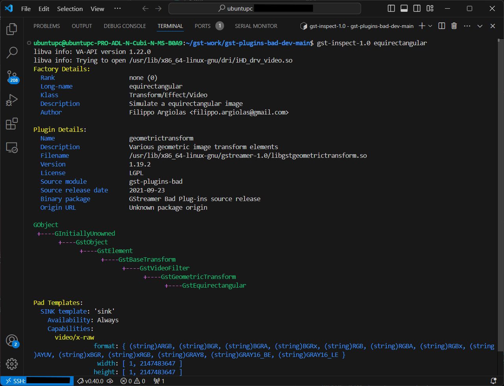

# 3-3 Developing GStreamer Plugins Project

GStreamer plugins are modular components that extend the functionality of the GStreamer multimedia framework by providing specific capabilities like data sources, filters, encoders, decoders, and sinks. Each plugin contains one or more elements that perform a particular task, such as reading from a file, decoding video, applying effects, or streaming media over a network. Plugins are categorized into groups like *base, good, bad,* and *ugly* based on their quality, licensing, and stability. They allow developers to create complex media pipelines by combining elements dynamically, making GStreamer highly flexible and extensible for diverse multimedia applications.

The image below shows how GStreamer elements are linked as a pipeline.



---

## Installing GStreamer

To install GStreamer on Ubuntu 22.04, use the following command:

```bash
sudo apt install libgstreamer1.0-dev libgstreamer-plugins-base1.0-dev libgstreamer-plugins-bad1.0-dev gstreamer1.0-plugins-base gstreamer1.0-plugins-good gstreamer1.0-plugins-bad gstreamer1.0-plugins-ugly gstreamer1.0-libav gstreamer1.0-tools gstreamer1.0-x gstreamer1.0-alsa gstreamer1.0-gl gstreamer1.0-gtk3 gstreamer1.0-qt5 gstreamer1.0-pulseaudio
```

Try out this Hello World tutorial below by creating a program named 'basic-tutorial-1.c`.

```c title="basic-tutorial-1.c"
#include <gst/gst.h>

#ifdef __APPLE__
#include <TargetConditionals.h>
#endif

int
tutorial_main (int argc, char *argv[])
{
  GstElement *pipeline;
  GstBus *bus;
  GstMessage *msg;

  /* Initialize GStreamer */
  gst_init (&argc, &argv);

  /* Build the pipeline */
  pipeline =
      gst_parse_launch
      ("playbin uri=https://gstreamer.freedesktop.org/data/media/sintel_trailer-480p.webm",
      NULL);

  /* Start playing */
  gst_element_set_state (pipeline, GST_STATE_PLAYING);

  /* Wait until error or EOS */
  bus = gst_element_get_bus (pipeline);
  msg =
      gst_bus_timed_pop_filtered (bus, GST_CLOCK_TIME_NONE,
      GST_MESSAGE_ERROR | GST_MESSAGE_EOS);

  /* See next tutorial for proper error message handling/parsing */
  if (GST_MESSAGE_TYPE (msg) == GST_MESSAGE_ERROR) {
    g_printerr ("An error occurred! Re-run with the GST_DEBUG=*:WARN "
        "environment variable set for more details.\n");
  }

  /* Free resources */
  gst_message_unref (msg);
  gst_object_unref (bus);
  gst_element_set_state (pipeline, GST_STATE_NULL);
  gst_object_unref (pipeline);
  return 0;
}

int
main (int argc, char *argv[])
{
#if defined(__APPLE__) && TARGET_OS_MAC && !TARGET_OS_IPHONE
  return gst_macos_main ((GstMainFunc) tutorial_main, argc, argv, NULL);
#else
  return tutorial_main (argc, argv);
#endif
}
```

Compile it by using the command below:

```bash
gcc basic-tutorial-1.c -o basic-tutorial-1 `pkg-config --cflags --libs gstreamer-1.0`
```

If everything is built correctly, you may run the executable. You should see a window pop up, containing a video being played straight from the Internet, along with audio.

:::tip[Try out these commands!]

Examples:
```bash
gst-inspect-1.0 geometrictransform
```
```bash
gst-inspect-1.0 circle
```
The commands above will show information such as the source module, plugin and element.

```bash
gst-launch-1.0 videotestsrc pattern=0 ! autovideosink
```

Different patterns can be generated by adjusting the `pattern` parameter from 0 to 25.

```bash
gst-launch-1.0 videotestsrc ! video/x-raw, width=1920, height=1080 ! videoconvert ! circle ! videoconvert ! autovideosink 
```
Feel free to play around by adding more parameters and observe the output!

:::

## Set Up Development Environment Using `gst-plugins-bad-dev`

The `gst-plugins-bad-dev` package is part of the GStreamer multimedia framework and provides the development files needed for working with the "bad" set of plugins in GStreamer.

:::info[What are GStreamer plugins?]

GStreamer plugins are modular components that extend the functionality of GStreamer by providing support for various codecs, formats, protocols, and other multimedia capabilities. These plugins are grouped into four categories based on their stability and quality:

1. `Base`: Stable, well-maintained, and widely used plugins.
2. `Good`: Good-quality plugins that are reliable and free from licensing issues.
3. `Bad`: Experimental plugins that are under development or have known issues (may require more testing or refinement).
4. `Ugly`: High-quality plugins with licensing or patent concerns.

:::

Download the modified project here by cloning the GitHub repo below:

```bash
git clone https://github.com/yourskc/gst-plugins-bad-dev
```

which is developed based on the [original project](https://github.com/GStreamer/gst-plugins-bad).

This modified project includes a new element named `equirectangular` as part of the gst-plugins-bad geometric transform plugin. It contains GStreamer code units, build instructions, and test commands.

## Installing Meson

Install the Meson build system:

```bash
sudo apt-get install python3 python3-pip python3-setuptools \
python3-wheel ninja-build
```

Go to the `~/gst-work/gst-plugins-bad-dev-main` directory and start the build:

```bash
meson build
ninja -C build
```

Verify the build by checking the creation of the file `libgstgeometrictransform.so` in the directory `~/gst-work/gst-plugins-bad-dev-main/build/gst/geometrictransform`.

Install the library and inspect:

```bash
sudo cp ./build/gst/geometrictransform/libgstgeometrictransform.so /usr/lib/x86_64-linux-gnu/gstreamer-1.0
```
```bash
gst-inspect-1.0 equirectangular
```

The expected output should be:



## Testing With Various Sources

### Test Source

Basic test with video test source:

```bash
cd test_env
gst-launch-1.0 videotestsrc ! video/x-raw,width=1920,height=1080 ! videoconvert ! equirectangular ! videoconvert ! autovideosink
```

:::warning[Attention!]

Ensure the execution directory contains `EquimatX` and `EquimatY` files.

:::

### MP4 File

To test with mp4 files, use the example below:

```bash
gst-launch-1.0 playbin uri=file:///path/to/video.mp4 video-sink="videoconvert ! equirectangular ! videoconvert ! autovideosink"
```

Try another example:

```bash
gst-launch-1.0 filesrc location=endo01.mp4 ! qtdemux ! queue ! avdec_h264 ! videoconvert ! equirectangular ! videoconvert ! autovideosink
```

:::tip

- `gst-launch-1.0 playbin`: a high-level, automated pipeline setup
- `gst-launch-1.0 filesrc`: a low-level, fully customized pipeline

:::

### Network Streaming

Now, we will test out network streaming. On the mini PC, run:

```bash
gst-launch-1.0 -v udpsrc uri=udp://127.0.0.1:5000 ! application/x-rtp, media=video, payload=96, encoding-name=H264 ! rtph264depay ! avdec_h264 ! videoconvert ! autovideosink
```

The mini will wait for an incoming stream. For the source, we will run the command below on the remote terminal in VS Code.

```bash
gst-launch-1.0 videotestsrc ! video/x-raw, width=1920, height=1080 ! videoconvert ! equirectangular ! videoconvert ! x264enc ! rtph264pay config-interval=10 ! udpsink host=127.0.0.1 port=5000
```

The output will be displayed on the mini PC.

### USB Camera

First, connect a USB camera to mini PC and replace the source in the command as shown below:

```bash
gst-launch-1.0 v4l2src device=/dev/video0 ! videoscale ! video/x-raw, width=1920, height=1080 ! videoconvert ! equirectangular ! videoconvert ! x264enc ! rtph264pay config-interval=10 ! udpsink host=localhost port=5000
```

The camera output will be displayed.

:::tip[Video4Linux]

To install Video4Linux, run `sudo apt-get install v4l-utils`. A few useful commands include:

- `v4l2-ctl --list-devices`: list all camera devices
- `v4l2-ctl -d /dev/video0 -D`: display driver information
- `v4l2-ctl -d /dev/video0 --list-formats-ext`: display all supported image formats

:::

---

## References

- [Installing GStreamer](https://gstreamer.freedesktop.org/documentation/installing/index.html?gi-language=c)

- [Basic Tutorial 1: Hello world!](https://gstreamer.freedesktop.org/documentation/tutorials/basic/hello-world.html?gi-language=c)

- [`gst-launch-1.0`](https://gstreamer.freedesktop.org/documentation/tools/gst-launch.html?gi-language=c)

- [`gst-inspect-1.0`](https://gstreamer.freedesktop.org/documentation/tools/gst-inspect.html?gi-language=c#)

---